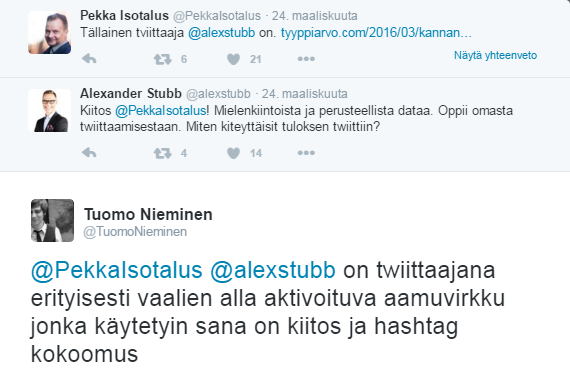

*Graphic by Heikki Ritaluoma*

# Welcome to the Stubbtweets repository

This Github repository includes the codes for explorations of former prime minister of Finland Alexsander Stubb's tweets, retreived from the twitter API and ananalyzed using the R programming language for statistical analysis. 

## Publications

Descriptive explorations of the tweets can be seen [on this GitHub page](https://tuomonieminen.github.io/StubbTweets/) and a more detailed article (in Finnish) is published in [Tyyppiarvo.com](http://tyyppiarvo.com/2016/03/kannanottoja-ja-kokoomus-tsemppia-tassa-kaikki-mita-pitaa-tietaa-stubbin-twitterista/)

## A comment from Stubb

Naturally, the former prime minister commented on the analysis using twitter.

