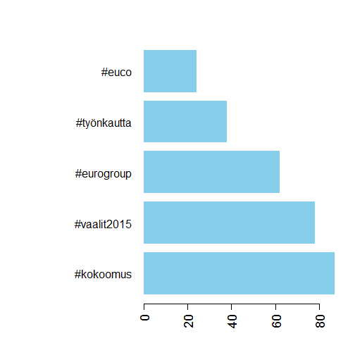
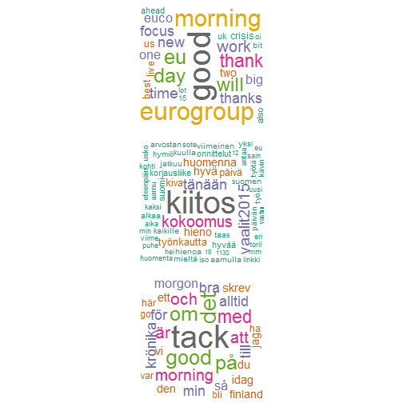

# Wellcome

description of the project here

## Explorative analysis

Some basic exploration of the data via pics. Timelines of tweets.

### Scope


mindate     | maxdate     | tweets
----------- | ----------- | -------
14.02.2015 | 19.02.2016 | 1740


### Monthly tweets


```r
par(mar=c(8,9,6,4))
h <- hist(tw$created, main = paste(tweeter, "tweets by month"),
     breaks="month", freq=T, 
     xlab="",ylab="", las=2,
     labels=T, cex.axis=1.3, cex.lab=1.5,
     ylim= c(0,400), format="%Y-%m",
     col="cadetblue3")
mtext(side = 2, text = "tweets", line = 5, cex = 1.5)
```


### Daily tweets


```r
par(mar=c(7,9,5,3))
h <- hist(tw$created, main = paste(tweeter, "tweets by day"),
          breaks="days", freq=T, 
          xlab="", ylab="",col="grey55", lty=0,
          cex.axis=1.3 ,cex.lab=1.5, tck=0.05, xaxt="n")
peaks=2
tickpos <- h$breaks[order(h$counts,decreasing=T)[1:peaks]]
labels <- names(sort(table(format(tw$created,"%d.%m.%Y")),decreasing=T))[1:peaks]
axis(1, at=tickpos, labels=labels,cex.axis=1.5)
mtext(side = 2, text = "tweets", line = 5, cex = 1.5)
mtext(side = 1, text = "day", line = 3, cex = 1.5)
```


### Hourly tweets


```r
hourly <- table(format(tw$created,"%H"))
hourly_prc <- paste(round(100*hourly/sum(hourly),1),"%")
par(mar=c(8,10,5,3))
bp <- barplot(hourly, main = paste(tweeter, "tweets by hour"),
              space=0.5, ylim=c(0,250),
              ylab="",cex.lab=1, cex.names = 1.2,
              cex.axis=1.2, las=2, col = "deepskyblue3",
              xlab="")
text(bp+0.1, hourly, hourly_prc, pos=3, cex=0.7) 
mtext(side = 2, text = "tweets", line = 5, cex = 1.3)
mtext(side = 1, text = "time", line = 5, cex = 1.3)
```


### Most active tweet days


```r
top5tweetdays <- sort(table(format(tw$created,"%Y-%m-%d")),decreasing=T)[1:5]
top5tweetdays
```

```
## 
## 2015-12-16 2015-04-18 2015-04-01 2015-04-16 2015-03-10 
##         43         36         22         22         21
```


### Tweet times during the most active days


```r
top5days <- names(top5tweetdays)

topdaydata <- lapply(1:4,function(day) {
  get_datedata(tw, top5days[day])
})

newpar <- par(mfrow=c(2,2))
for(i in 1:4){
  time <- topdaydata[[i]]$created
  hist(time, breaks=100,freq=T,border=NULL,ylab="Tweets",
       tck=0,cex.axis=0.8, cex.lab=0.8, xlab="",
       main=paste0(tweeter," ",top5days[i]),
       cex.main=1, ylim=c(0,8))
}
```


### Hashtag frequencies


```r
hashcounts <- extract_hashes(tw$text)
hash <- head(hashcounts, 5)
kable(hash)
```


|tag         | freq|
|:-----------|----:|
|#kokoomus   |   87|
|#vaalit2015 |   78|
|#eurogroup  |   62|
|#työnkautta |   38|
|#euco       |   24|


```r
par(las=2, mar=c(5,14,4,2))
barplot(hash$freq, horiz=T, names.arg=hash$tag,
        cex.names=1.3, cex.axis = 1.5,
        col = "skyblue", border=NA)
```



### Most used words


```r
# document term matrices for each language
DTM <- get(load(paste0("data/",tweeter,"_DTM.Rda")))

# word frequencies for each language
FREQ <- lapply(DTM, twitter_wordfreqs)
names(FREQ) <- names(DTM)

# wordclouds
par(mfrow= c(3,1))
lapply(FREQ, function(lang) {
  wordcloud(lang$word, lang$freq,
            scale = c(6,1),
            random.order=FALSE, colors=brewer.pal(8, "Dark2"))
})
```

```
## Warning in wordcloud(lang$word, lang$freq, scale = c(6, 1), random.order =
## FALSE, : eurogroup could not be fit on page. It will not be plotted.
```

```
## Warning in wordcloud(lang$word, lang$freq, scale = c(6, 1), random.order =
## FALSE, : day could not be fit on page. It will not be plotted.
```

```
## Warning in wordcloud(lang$word, lang$freq, scale = c(6, 1), random.order =
## FALSE, : will could not be fit on page. It will not be plotted.
```

```
## Warning in wordcloud(lang$word, lang$freq, scale = c(6, 1), random.order =
## FALSE, : thank could not be fit on page. It will not be plotted.
```

```
## Warning in wordcloud(lang$word, lang$freq, scale = c(6, 1), random.order =
## FALSE, : government could not be fit on page. It will not be plotted.
```

```
## Warning in wordcloud(lang$word, lang$freq, scale = c(6, 1), random.order =
## FALSE, : tomorrow could not be fit on page. It will not be plotted.
```

```
## Warning in wordcloud(lang$word, lang$freq, scale = c(6, 1), random.order =
## FALSE, : work could not be fit on page. It will not be plotted.
```

```
## Warning in wordcloud(lang$word, lang$freq, scale = c(6, 1), random.order =
## FALSE, : time could not be fit on page. It will not be plotted.
```

```
## Warning in wordcloud(lang$word, lang$freq, scale = c(6, 1), random.order =
## FALSE, : finnish could not be fit on page. It will not be plotted.
```

```
## Warning in wordcloud(lang$word, lang$freq, scale = c(6, 1), random.order =
## FALSE, : meeting could not be fit on page. It will not be plotted.
```

```
## Warning in wordcloud(lang$word, lang$freq, scale = c(6, 1), random.order =
## FALSE, : brussels could not be fit on page. It will not be plotted.
```

```
## Warning in wordcloud(lang$word, lang$freq, scale = c(6, 1), random.order =
## FALSE, : greece could not be fit on page. It will not be plotted.
```

```
## Warning in wordcloud(lang$word, lang$freq, scale = c(6, 1), random.order =
## FALSE, : interview could not be fit on page. It will not be plotted.
```

```
## Warning in wordcloud(lang$word, lang$freq, scale = c(6, 1), random.order =
## FALSE, : thanks could not be fit on page. It will not be plotted.
```

```
## Warning in wordcloud(lang$word, lang$freq, scale = c(6, 1), random.order =
## FALSE, : focus could not be fit on page. It will not be plotted.
```

```
## Warning in wordcloud(lang$word, lang$freq, scale = c(6, 1), random.order =
## FALSE, : one could not be fit on page. It will not be plotted.
```

```
## Warning in wordcloud(lang$word, lang$freq, scale = c(6, 1), random.order =
## FALSE, : budget could not be fit on page. It will not be plotted.
```

```
## Warning in wordcloud(lang$word, lang$freq, scale = c(6, 1), random.order =
## FALSE, : euco could not be fit on page. It will not be plotted.
```

```
## Warning in wordcloud(lang$word, lang$freq, scale = c(6, 1), random.order =
## FALSE, : column could not be fit on page. It will not be plotted.
```

```
## Warning in wordcloud(lang$word, lang$freq, scale = c(6, 1), random.order =
## FALSE, : foreign could not be fit on page. It will not be plotted.
```

```
## Warning in wordcloud(lang$word, lang$freq, scale = c(6, 1), random.order =
## FALSE, : forward could not be fit on page. It will not be plotted.
```

```
## Warning in wordcloud(lang$word, lang$freq, scale = c(6, 1), random.order =
## FALSE, : early could not be fit on page. It will not be plotted.
```

```
## Warning in wordcloud(lang$word, lang$freq, scale = c(6, 1), random.order =
## FALSE, : interesting could not be fit on page. It will not be plotted.
```

```
## Warning in wordcloud(lang$word, lang$freq, scale = c(6, 1), random.order =
## FALSE, : parliament could not be fit on page. It will not be plotted.
```

```
## Warning in wordcloud(lang$word, lang$freq, scale = c(6, 1), random.order =
## FALSE, : great could not be fit on page. It will not be plotted.
```

```
## Warning in wordcloud(lang$word, lang$freq, scale = c(6, 1), random.order =
## FALSE, : looking could not be fit on page. It will not be plotted.
```

```
## Warning in wordcloud(lang$word, lang$freq, scale = c(6, 1), random.order =
## FALSE, : policy could not be fit on page. It will not be plotted.
```

```
## Warning in wordcloud(lang$word, lang$freq, scale = c(6, 1), random.order =
## FALSE, : week could not be fit on page. It will not be plotted.
```

```
## Warning in wordcloud(lang$word, lang$freq, scale = c(6, 1), random.order =
## FALSE, : working could not be fit on page. It will not be plotted.
```

```
## Warning in wordcloud(lang$word, lang$freq, scale = c(6, 1), random.order =
## FALSE, : periscope could not be fit on page. It will not be plotted.
```

```
## Warning in wordcloud(lang$word, lang$freq, scale = c(6, 1), random.order =
## FALSE, : wings could not be fit on page. It will not be plotted.
```

```
## Warning in wordcloud(lang$word, lang$freq, scale = c(6, 1), random.order =
## FALSE, : always could not be fit on page. It will not be plotted.
```

```
## Warning in wordcloud(lang$word, lang$freq, scale = c(6, 1), random.order =
## FALSE, : ecofin could not be fit on page. It will not be plotted.
```

```
## Warning in wordcloud(lang$word, lang$freq, scale = c(6, 1), random.order =
## FALSE, : speech could not be fit on page. It will not be plotted.
```

```
## Warning in wordcloud(lang$word, lang$freq, scale = c(6, 1), random.order =
## FALSE, : congrats could not be fit on page. It will not be plotted.
```

```
## Warning in wordcloud(lang$word, lang$freq, scale = c(6, 1), random.order =
## FALSE, : economy could not be fit on page. It will not be plotted.
```

```
## Warning in wordcloud(lang$word, lang$freq, scale = c(6, 1), random.order =
## FALSE, : helsinki could not be fit on page. It will not be plotted.
```

```
## Warning in wordcloud(lang$word, lang$freq, scale = c(6, 1), random.order =
## FALSE, : meetings could not be fit on page. It will not be plotted.
```

```
## Warning in wordcloud(lang$word, lang$freq, scale = c(6, 1), random.order =
## FALSE, : security could not be fit on page. It will not be plotted.
```

```
## Warning in wordcloud(lang$word, lang$freq, scale = c(6, 1), random.order =
## FALSE, : interviews could not be fit on page. It will not be plotted.
```

```
## Warning in wordcloud(lang$word, lang$freq, scale = c(6, 1), random.order =
## FALSE, : negotiations could not be fit on page. It will not be plotted.
```

```
## Warning in wordcloud(lang$word, lang$freq, scale = c(6, 1), random.order =
## FALSE, : now could not be fit on page. It will not be plotted.
```

```
## Warning in wordcloud(lang$word, lang$freq, scale = c(6, 1), random.order =
## FALSE, : live could not be fit on page. It will not be plotted.
```

```
## Warning in wordcloud(lang$word, lang$freq, scale = c(6, 1), random.order =
## FALSE, : world could not be fit on page. It will not be plotted.
```

```
## Warning in wordcloud(lang$word, lang$freq, scale = c(6, 1), random.order =
## FALSE, : begins could not be fit on page. It will not be plotted.
```

```
## Warning in wordcloud(lang$word, lang$freq, scale = c(6, 1), random.order =
## FALSE, : davos2016 could not be fit on page. It will not be plotted.
```

```
## Warning in wordcloud(lang$word, lang$freq, scale = c(6, 1), random.order =
## FALSE, : european could not be fit on page. It will not be plotted.
```

```
## Warning in wordcloud(lang$word, lang$freq, scale = c(6, 1), random.order =
## FALSE, : first could not be fit on page. It will not be plotted.
```

```
## Warning in wordcloud(lang$word, lang$freq, scale = c(6, 1), random.order =
## FALSE, : news could not be fit on page. It will not be plotted.
```

```
## Warning in wordcloud(lang$word, lang$freq, scale = c(6, 1), random.order =
## FALSE, : panel could not be fit on page. It will not be plotted.
```

```
## Warning in wordcloud(lang$word, lang$freq, scale = c(6, 1), random.order =
## FALSE, : twitter could not be fit on page. It will not be plotted.
```

```
## Warning in wordcloud(lang$word, lang$freq, scale = c(6, 1), random.order =
## FALSE, : welcome could not be fit on page. It will not be plotted.
```

```
## Warning in wordcloud(lang$word, lang$freq, scale = c(6, 1), random.order =
## FALSE, : back could not be fit on page. It will not be plotted.
```

```
## Warning in wordcloud(lang$word, lang$freq, scale = c(6, 1), random.order =
## FALSE, : best could not be fit on page. It will not be plotted.
```

```
## Warning in wordcloud(lang$word, lang$freq, scale = c(6, 1), random.order =
## FALSE, : cabinet could not be fit on page. It will not be plotted.
```

```
## Warning in wordcloud(lang$word, lang$freq, scale = c(6, 1), random.order =
## FALSE, : colleagues could not be fit on page. It will not be plotted.
```

```
## Warning in wordcloud(lang$word, lang$freq, scale = c(6, 1), random.order =
## FALSE, : davos could not be fit on page. It will not be plotted.
```

```
## Warning in wordcloud(lang$word, lang$freq, scale = c(6, 1), random.order =
## FALSE, : economic could not be fit on page. It will not be plotted.
```

```
## Warning in wordcloud(lang$word, lang$freq, scale = c(6, 1), random.order =
## FALSE, : euro could not be fit on page. It will not be plotted.
```

```
## Warning in wordcloud(lang$word, lang$freq, scale = c(6, 1), random.order =
## FALSE, : next could not be fit on page. It will not be plotted.
```

```
## Warning in wordcloud(lang$word, lang$freq, scale = c(6, 1), random.order =
## FALSE, : committee could not be fit on page. It will not be plotted.
```

```
## Warning in wordcloud(lang$word, lang$freq, scale = c(6, 1), random.order =
## FALSE, : evening could not be fit on page. It will not be plotted.
```

```
## Warning in wordcloud(lang$word, lang$freq, scale = c(6, 1), random.order =
## FALSE, : hope could not be fit on page. It will not be plotted.
```

```
## Warning in wordcloud(lang$word, lang$freq, scale = c(6, 1), random.order =
## FALSE, : phone could not be fit on page. It will not be plotted.
```

```
## Warning in wordcloud(lang$word, lang$freq, scale = c(6, 1), random.order =
## FALSE, : question could not be fit on page. It will not be plotted.
```

```
## Warning in wordcloud(lang$word, lang$freq, scale = c(6, 1), random.order =
## FALSE, : continue could not be fit on page. It will not be plotted.
```

```
## Warning in wordcloud(lang$word, lang$freq, scale = c(6, 1), random.order =
## FALSE, : crisis could not be fit on page. It will not be plotted.
```

```
## Warning in wordcloud(lang$word, lang$freq, scale = c(6, 1), random.order =
## FALSE, : days could not be fit on page. It will not be plotted.
```

```
## Warning in wordcloud(lang$word, lang$freq, scale = c(6, 1), random.order =
## FALSE, : doorstep could not be fit on page. It will not be plotted.
```

```
## Warning in wordcloud(lang$word, lang$freq, scale = c(6, 1), random.order =
## FALSE, : grand could not be fit on page. It will not be plotted.
```

```
## Warning in wordcloud(lang$word, lang$freq, scale = c(6, 1), random.order =
## FALSE, : important could not be fit on page. It will not be plotted.
```

```
## Warning in wordcloud(lang$word, lang$freq, scale = c(6, 1), random.order =
## FALSE, : just could not be fit on page. It will not be plotted.
```

```
## Warning in wordcloud(lang$word, lang$freq, scale = c(6, 1), random.order =
## FALSE, : like could not be fit on page. It will not be plotted.
```

```
## Warning in wordcloud(lang$word, lang$freq, scale = c(6, 1), random.order =
## FALSE, : wrote could not be fit on page. It will not be plotted.
```

```
## Warning in wordcloud(lang$word, lang$freq, scale = c(6, 1), random.order =
## FALSE, : breakfast could not be fit on page. It will not be plotted.
```

```
## Warning in wordcloud(lang$word, lang$freq, scale = c(6, 1), random.order =
## FALSE, : elections could not be fit on page. It will not be plotted.
```

```
## Warning in wordcloud(lang$word, lang$freq, scale = c(6, 1), random.order =
## FALSE, : go could not be fit on page. It will not be plotted.
```

```
## Warning in wordcloud(lang$word, lang$freq, scale = c(6, 1), random.order =
## FALSE, : hour could not be fit on page. It will not be plotted.
```

```
## Warning in wordcloud(lang$word, lang$freq, scale = c(6, 1), random.order =
## FALSE, : kokoomus could not be fit on page. It will not be plotted.
```

```
## Warning in wordcloud(lang$word, lang$freq, scale = c(6, 1), random.order =
## FALSE, : parliamentary could not be fit on page. It will not be plotted.
```

```
## Warning in wordcloud(lang$word, lang$freq, scale = c(6, 1), random.order =
## FALSE, : read could not be fit on page. It will not be plotted.
```

```
## Warning in wordcloud(lang$word, lang$freq, scale = c(6, 1), random.order =
## FALSE, : thoughts could not be fit on page. It will not be plotted.
```

```
## Warning in wordcloud(lang$word, lang$freq, scale = c(6, 1), random.order =
## FALSE, : warm could not be fit on page. It will not be plotted.
```

```
## Warning in wordcloud(lang$word, lang$freq, scale = c(6, 1), random.order =
## FALSE, : years could not be fit on page. It will not be plotted.
```

```
## Warning in wordcloud(lang$word, lang$freq, scale = c(6, 1), random.order =
## FALSE, : ahead could not be fit on page. It will not be plotted.
```

```
## Warning in wordcloud(lang$word, lang$freq, scale = c(6, 1), random.order =
## FALSE, : also could not be fit on page. It will not be plotted.
```

```
## Warning in wordcloud(lang$word, lang$freq, scale = c(6, 1), random.order =
## FALSE, : beautiful could not be fit on page. It will not be plotted.
```

```
## Warning in wordcloud(lang$word, lang$freq, scale = c(6, 1), random.order =
## FALSE, : condolences could not be fit on page. It will not be plotted.
```

```
## Warning in wordcloud(lang$word, lang$freq, scale = c(6, 1), random.order =
## FALSE, : ends could not be fit on page. It will not be plotted.
```

```
## Warning in wordcloud(lang$word, lang$freq, scale = c(6, 1), random.order =
## FALSE, : english could not be fit on page. It will not be plotted.
```

```
## Warning in wordcloud(lang$word, lang$freq, scale = c(6, 1), random.order =
## FALSE, : excellent could not be fit on page. It will not be plotted.
```

```
## Warning in wordcloud(lang$word, lang$freq, scale = c(6, 1), random.order =
## FALSE, : five could not be fit on page. It will not be plotted.
```

```
## Warning in wordcloud(lang$word, lang$freq, scale = c(6, 1), random.order =
## FALSE, : happy could not be fit on page. It will not be plotted.
```

```
## Warning in wordcloud(lang$word, lang$freq, scale = c(6, 1), random.order =
## FALSE, : hard could not be fit on page. It will not be plotted.
```

```
## Warning in wordcloud(lang$word, lang$freq, scale = c(6, 1), random.order =
## FALSE, : media could not be fit on page. It will not be plotted.
```

```
## Warning in wordcloud(lang$word, lang$freq, scale = c(6, 1), random.order =
## FALSE, : old could not be fit on page. It will not be plotted.
```

```
## Warning in wordcloud(lang$word, lang$freq, scale = c(6, 1), random.order =
## FALSE, : programme could not be fit on page. It will not be plotted.
```

```
## Warning in wordcloud(lang$word, lang$freq, scale = c(6, 1), random.order =
## FALSE, : reform could not be fit on page. It will not be plotted.
```

```
## Warning in wordcloud(lang$word, lang$freq, scale = c(6, 1), random.order =
## FALSE, : session could not be fit on page. It will not be plotted.
```

```
## Warning in wordcloud(lang$word, lang$freq, scale = c(6, 1), random.order =
## FALSE, : uk could not be fit on page. It will not be plotted.
```

```
## Warning in wordcloud(lang$word, lang$freq, scale = c(6, 1), random.order =
## FALSE, : yesterday could not be fit on page. It will not be plotted.
```

```
## Warning in wordcloud(lang$word, lang$freq, scale = c(6, 1), random.order =
## FALSE, : appreciated could not be fit on page. It will not be plotted.
```

```
## Warning in wordcloud(lang$word, lang$freq, scale = c(6, 1), random.order =
## FALSE, : beginning could not be fit on page. It will not be plotted.
```

```
## Warning in wordcloud(lang$word, lang$freq, scale = c(6, 1), random.order =
## FALSE, : comments could not be fit on page. It will not be plotted.
```

```
## Warning in wordcloud(lang$word, lang$freq, scale = c(6, 1), random.order =
## FALSE, : debate could not be fit on page. It will not be plotted.
```

```
## Warning in wordcloud(lang$word, lang$freq, scale = c(6, 1), random.order =
## FALSE, : going could not be fit on page. It will not be plotted.
```

```
## Warning in wordcloud(lang$word, lang$freq, scale = c(6, 1), random.order =
## FALSE, : home could not be fit on page. It will not be plotted.
```

```
## Warning in wordcloud(lang$word, lang$freq, scale = c(6, 1), random.order =
## FALSE, : light could not be fit on page. It will not be plotted.
```

```
## Warning in wordcloud(lang$word, lang$freq, scale = c(6, 1), random.order =
## FALSE, : love could not be fit on page. It will not be plotted.
```

```
## Warning in wordcloud(lang$word, lang$freq, scale = c(6, 1), random.order =
## FALSE, : ministers could not be fit on page. It will not be plotted.
```

```
## Warning in wordcloud(lang$word, lang$freq, scale = c(6, 1), random.order =
## FALSE, : party could not be fit on page. It will not be plotted.
```

```
## Warning in wordcloud(lang$word, lang$freq, scale = c(6, 1), random.order =
## FALSE, : proud could not be fit on page. It will not be plotted.
```

```
## Warning in wordcloud(lang$word, lang$freq, scale = c(6, 1), random.order =
## FALSE, : reading could not be fit on page. It will not be plotted.
```

```
## Warning in wordcloud(lang$word, lang$freq, scale = c(6, 1), random.order =
## FALSE, : ready could not be fit on page. It will not be plotted.
```

```
## Warning in wordcloud(lang$word, lang$freq, scale = c(6, 1), random.order =
## FALSE, : situation could not be fit on page. It will not be plotted.
```

```
## Warning in wordcloud(lang$word, lang$freq, scale = c(6, 1), random.order =
## FALSE, : social could not be fit on page. It will not be plotted.
```

```
## Warning in wordcloud(lang$word, lang$freq, scale = c(6, 1), random.order =
## FALSE, : start could not be fit on page. It will not be plotted.
```

```
## Warning in wordcloud(lang$word, lang$freq, scale = c(6, 1), random.order =
## FALSE, : team could not be fit on page. It will not be plotted.
```

```
## Warning in wordcloud(lang$word, lang$freq, scale = c(6, 1), random.order =
## FALSE, : afternoon could not be fit on page. It will not be plotted.
```

```
## Warning in wordcloud(lang$word, lang$freq, scale = c(6, 1), random.order =
## FALSE, : agenda could not be fit on page. It will not be plotted.
```

```
## Warning in wordcloud(lang$word, lang$freq, scale = c(6, 1), random.order =
## FALSE, : another could not be fit on page. It will not be plotted.
```

```
## Warning in wordcloud(lang$word, lang$freq, scale = c(6, 1), random.order =
## FALSE, : begin could not be fit on page. It will not be plotted.
```

```
## Warning in wordcloud(lang$word, lang$freq, scale = c(6, 1), random.order =
## FALSE, : bit could not be fit on page. It will not be plotted.
```

```
## Warning in wordcloud(lang$word, lang$freq, scale = c(6, 1), random.order =
## FALSE, : campaigning could not be fit on page. It will not be plotted.
```

```
## Warning in wordcloud(lang$word, lang$freq, scale = c(6, 1), random.order =
## FALSE, : can could not be fit on page. It will not be plotted.
```

```
## Warning in wordcloud(lang$word, lang$freq, scale = c(6, 1), random.order =
## FALSE, : difficult could not be fit on page. It will not be plotted.
```

```
## Warning in wordcloud(lang$word, lang$freq, scale = c(6, 1), random.order =
## FALSE, : dinner could not be fit on page. It will not be plotted.
```

```
## Warning in wordcloud(lang$word, lang$freq, scale = c(6, 1), random.order =
## FALSE, : europe could not be fit on page. It will not be plotted.
```

```
## Warning in wordcloud(lang$word, lang$freq, scale = c(6, 1), random.order =
## FALSE, : friends could not be fit on page. It will not be plotted.
```

```
## Warning in wordcloud(lang$word, lang$freq, scale = c(6, 1), random.order =
## FALSE, : glad could not be fit on page. It will not be plotted.
```

```
## Warning in wordcloud(lang$word, lang$freq, scale = c(6, 1), random.order =
## FALSE, : group could not be fit on page. It will not be plotted.
```

```
## Warning in wordcloud(lang$word, lang$freq, scale = c(6, 1), random.order =
## FALSE, : international could not be fit on page. It will not be plotted.
```

```
## Warning in wordcloud(lang$word, lang$freq, scale = c(6, 1), random.order =
## FALSE, : issues could not be fit on page. It will not be plotted.
```

```
## Warning in wordcloud(lang$word, lang$freq, scale = c(6, 1), random.order =
## FALSE, : mandate could not be fit on page. It will not be plotted.
```

```
## Warning in wordcloud(lang$word, lang$freq, scale = c(6, 1), random.order =
## FALSE, : must could not be fit on page. It will not be plotted.
```

```
## Warning in wordcloud(lang$word, lang$freq, scale = c(6, 1), random.order =
## FALSE, : pm could not be fit on page. It will not be plotted.
```

```
## Warning in wordcloud(lang$word, lang$freq, scale = c(6, 1), random.order =
## FALSE, : refugee could not be fit on page. It will not be plotted.
```

```
## Warning in wordcloud(lang$word, lang$freq, scale = c(6, 1), random.order =
## FALSE, : short could not be fit on page. It will not be plotted.
```

```
## Warning in wordcloud(lang$word, lang$freq, scale = c(6, 1), random.order =
## FALSE, : things could not be fit on page. It will not be plotted.
```

```
## Warning in wordcloud(lang$word, lang$freq, scale = c(6, 1), random.order =
## FALSE, : todays could not be fit on page. It will not be plotted.
```

```
## Warning in wordcloud(lang$word, lang$freq, scale = c(6, 1), random.order =
## FALSE, : around could not be fit on page. It will not be plotted.
```

```
## Warning in wordcloud(lang$word, lang$freq, scale = c(6, 1), random.order =
## FALSE, : bruges could not be fit on page. It will not be plotted.
```

```
## Warning in wordcloud(lang$word, lang$freq, scale = c(6, 1), random.order =
## FALSE, : common could not be fit on page. It will not be plotted.
```

```
## Warning in wordcloud(lang$word, lang$freq, scale = c(6, 1), random.order =
## FALSE, : continues could not be fit on page. It will not be plotted.
```

```
## Warning in wordcloud(lang$word, lang$freq, scale = c(6, 1), random.order =
## FALSE, : council could not be fit on page. It will not be plotted.
```

```
## Warning in wordcloud(lang$word, lang$freq, scale = c(6, 1), random.order =
## FALSE, : dont could not be fit on page. It will not be plotted.
```

```
## Warning in wordcloud(lang$word, lang$freq, scale = c(6, 1), random.order =
## FALSE, : election could not be fit on page. It will not be plotted.
```

```
## Warning in wordcloud(lang$word, lang$freq, scale = c(6, 1), random.order =
## FALSE, : energy could not be fit on page. It will not be plotted.
```

```
## Warning in wordcloud(lang$word, lang$freq, scale = c(6, 1), random.order =
## FALSE, : epp could not be fit on page. It will not be plotted.
```

```
## Warning in wordcloud(lang$word, lang$freq, scale = c(6, 1), random.order =
## FALSE, : every could not be fit on page. It will not be plotted.
```

```
## Warning in wordcloud(lang$word, lang$freq, scale = c(6, 1), random.order =
## FALSE, : final could not be fit on page. It will not be plotted.
```

```
## Warning in wordcloud(lang$word, lang$freq, scale = c(6, 1), random.order =
## FALSE, : finance could not be fit on page. It will not be plotted.
```

```
## Warning in wordcloud(lang$word, lang$freq, scale = c(6, 1), random.order =
## FALSE, : find could not be fit on page. It will not be plotted.
```

```
## Warning in wordcloud(lang$word, lang$freq, scale = c(6, 1), random.order =
## FALSE, : following could not be fit on page. It will not be plotted.
```

```
## Warning in wordcloud(lang$word, lang$freq, scale = c(6, 1), random.order =
## FALSE, : france could not be fit on page. It will not be plotted.
```

```
## Warning in wordcloud(lang$word, lang$freq, scale = c(6, 1), random.order =
## FALSE, : friend could not be fit on page. It will not be plotted.
```

```
## Warning in wordcloud(lang$word, lang$freq, scale = c(6, 1), random.order =
## FALSE, : full could not be fit on page. It will not be plotted.
```

```
## Warning in wordcloud(lang$word, lang$freq, scale = c(6, 1), random.order =
## FALSE, : integration could not be fit on page. It will not be plotted.
```

```
## Warning in wordcloud(lang$word, lang$freq, scale = c(6, 1), random.order =
## FALSE, : job could not be fit on page. It will not be plotted.
```

```
## Warning in wordcloud(lang$word, lang$freq, scale = c(6, 1), random.order =
## FALSE, : long could not be fit on page. It will not be plotted.
```

```
## Warning in wordcloud(lang$word, lang$freq, scale = c(6, 1), random.order =
## FALSE, : luxembourg could not be fit on page. It will not be plotted.
```

```
## Warning in wordcloud(lang$word, lang$freq, scale = c(6, 1), random.order =
## FALSE, : minister could not be fit on page. It will not be plotted.
```

```
## Warning in wordcloud(lang$word, lang$freq, scale = c(6, 1), random.order =
## FALSE, : need could not be fit on page. It will not be plotted.
```

```
## Warning in wordcloud(lang$word, lang$freq, scale = c(6, 1), random.order =
## FALSE, : never could not be fit on page. It will not be plotted.
```

```
## Warning in wordcloud(lang$word, lang$freq, scale = c(6, 1), random.order =
## FALSE, : often could not be fit on page. It will not be plotted.
```

```
## Warning in wordcloud(lang$word, lang$freq, scale = c(6, 1), random.order =
## FALSE, : press could not be fit on page. It will not be plotted.
```

```
## Warning in wordcloud(lang$word, lang$freq, scale = c(6, 1), random.order =
## FALSE, : reforms could not be fit on page. It will not be plotted.
```

```
## Warning in wordcloud(lang$word, lang$freq, scale = c(6, 1), random.order =
## FALSE, : smiley could not be fit on page. It will not be plotted.
```

```
## Warning in wordcloud(lang$word, lang$freq, scale = c(6, 1), random.order =
## FALSE, : structural could not be fit on page. It will not be plotted.
```

```
## Warning in wordcloud(lang$word, lang$freq, scale = c(6, 1), random.order =
## FALSE, : take could not be fit on page. It will not be plotted.
```

```
## Warning in wordcloud(lang$word, lang$freq, scale = c(6, 1), random.order =
## FALSE, : think could not be fit on page. It will not be plotted.
```

```
## Warning in wordcloud(lang$word, lang$freq, scale = c(6, 1), random.order =
## FALSE, : three could not be fit on page. It will not be plotted.
```

```
## Warning in wordcloud(lang$word, lang$freq, scale = c(6, 1), random.order =
## FALSE, : tradition could not be fit on page. It will not be plotted.
```

```
## Warning in wordcloud(lang$word, lang$freq, scale = c(6, 1), random.order =
## FALSE, : watch could not be fit on page. It will not be plotted.
```

```
## Warning in wordcloud(lang$word, lang$freq, scale = c(6, 1), random.order =
## FALSE, : way could not be fit on page. It will not be plotted.
```

```
## Warning in wordcloud(lang$word, lang$freq, scale = c(6, 1), random.order =
## FALSE, : victims could not be fit on page. It will not be plotted.
```

```
## Warning in wordcloud(lang$word, lang$freq, scale = c(6, 1), random.order =
## FALSE, : visit could not be fit on page. It will not be plotted.
```

```
## Warning in wordcloud(lang$word, lang$freq, scale = c(6, 1), random.order =
## FALSE, : writing could not be fit on page. It will not be plotted.
```

```
## Warning in wordcloud(lang$word, lang$freq, scale = c(6, 1), random.order =
## FALSE, : 10 could not be fit on page. It will not be plotted.
```

```
## Warning in wordcloud(lang$word, lang$freq, scale = c(6, 1), random.order =
## FALSE, : amp could not be fit on page. It will not be plotted.
```

```
## Warning in wordcloud(lang$word, lang$freq, scale = c(6, 1), random.order =
## FALSE, : borg could not be fit on page. It will not be plotted.
```

```
## Warning in wordcloud(lang$word, lang$freq, scale = c(6, 1), random.order =
## FALSE, : centre could not be fit on page. It will not be plotted.
```

```
## Warning in wordcloud(lang$word, lang$freq, scale = c(6, 1), random.order =
## FALSE, : commission could not be fit on page. It will not be plotted.
```

```
## Warning in wordcloud(lang$word, lang$freq, scale = c(6, 1), random.order =
## FALSE, : discussion could not be fit on page. It will not be plotted.
```

```
## Warning in wordcloud(lang$word, lang$freq, scale = c(6, 1), random.order =
## FALSE, : eppmadrid could not be fit on page. It will not be plotted.
```

```
## Warning in wordcloud(lang$word, lang$freq, scale = c(6, 1), random.order =
## FALSE, : espoo could not be fit on page. It will not be plotted.
```

```
## Warning in wordcloud(lang$word, lang$freq, scale = c(6, 1), random.order =
## FALSE, : everyone could not be fit on page. It will not be plotted.
```

```
## Warning in wordcloud(lang$word, lang$freq, scale = c(6, 1), random.order =
## FALSE, : finlands could not be fit on page. It will not be plotted.
```

```
## Warning in wordcloud(lang$word, lang$freq, scale = c(6, 1), random.order =
## FALSE, : finns could not be fit on page. It will not be plotted.
```

```
## Warning in wordcloud(lang$word, lang$freq, scale = c(6, 1), random.order =
## FALSE, : former could not be fit on page. It will not be plotted.
```

```
## Warning in wordcloud(lang$word, lang$freq, scale = c(6, 1), random.order =
## FALSE, : found could not be fit on page. It will not be plotted.
```

```
## Warning in wordcloud(lang$word, lang$freq, scale = c(6, 1), random.order =
## FALSE, : friday could not be fit on page. It will not be plotted.
```

```
## Warning in wordcloud(lang$word, lang$freq, scale = c(6, 1), random.order =
## FALSE, : getting could not be fit on page. It will not be plotted.
```

```
## Warning in wordcloud(lang$word, lang$freq, scale = c(6, 1), random.order =
## FALSE, : god could not be fit on page. It will not be plotted.
```

```
## Warning in wordcloud(lang$word, lang$freq, scale = c(6, 1), random.order =
## FALSE, : head could not be fit on page. It will not be plotted.
```

```
## Warning in wordcloud(lang$word, lang$freq, scale = c(6, 1), random.order =
## FALSE, : heart could not be fit on page. It will not be plotted.
```

```
## Warning in wordcloud(lang$word, lang$freq, scale = c(6, 1), random.order =
## FALSE, : indeed could not be fit on page. It will not be plotted.
```

```
## Warning in wordcloud(lang$word, lang$freq, scale = c(6, 1), random.order =
## FALSE, : jarkko could not be fit on page. It will not be plotted.
```

```
## Warning in wordcloud(lang$word, lang$freq, scale = c(6, 1), random.order =
## FALSE, : kiitos could not be fit on page. It will not be plotted.
```

```
## Warning in wordcloud(lang$word, lang$freq, scale = c(6, 1), random.order =
## FALSE, : know could not be fit on page. It will not be plotted.
```

```
## Warning in wordcloud(lang$word, lang$freq, scale = c(6, 1), random.order =
## FALSE, : last could not be fit on page. It will not be plotted.
```

```
## Warning in wordcloud(lang$word, lang$freq, scale = c(6, 1), random.order =
## FALSE, : latest could not be fit on page. It will not be plotted.
```

```
## Warning in wordcloud(lang$word, lang$freq, scale = c(6, 1), random.order =
## FALSE, : lets could not be fit on page. It will not be plotted.
```

```
## Warning in wordcloud(lang$word, lang$freq, scale = c(6, 1), random.order =
## FALSE, : man could not be fit on page. It will not be plotted.
```

```
## Warning in wordcloud(lang$word, lang$freq, scale = c(6, 1), random.order =
## FALSE, : many could not be fit on page. It will not be plotted.
```

```
## Warning in wordcloud(lang$word, lang$freq, scale = c(6, 1), random.order =
## FALSE, : morgon could not be fit on page. It will not be plotted.
```

```
## Warning in wordcloud(lang$word, lang$freq, scale = c(6, 1), random.order =
## FALSE, : myinterview could not be fit on page. It will not be plotted.
```

```
## Warning in wordcloud(lang$word, lang$freq, scale = c(6, 1), random.order =
## FALSE, : normal could not be fit on page. It will not be plotted.
```

```
## Warning in wordcloud(lang$word, lang$freq, scale = c(6, 1), random.order =
## FALSE, : order could not be fit on page. It will not be plotted.
```

```
## Warning in wordcloud(lang$word, lang$freq, scale = c(6, 1), random.order =
## FALSE, : papers could not be fit on page. It will not be plotted.
```

```
## Warning in wordcloud(lang$word, lang$freq, scale = c(6, 1), random.order =
## FALSE, : piece could not be fit on page. It will not be plotted.
```

```
## Warning in wordcloud(lang$word, lang$freq, scale = c(6, 1), random.order =
## FALSE, : preparing could not be fit on page. It will not be plotted.
```

```
## Warning in wordcloud(lang$word, lang$freq, scale = c(6, 1), random.order =
## FALSE, : rather could not be fit on page. It will not be plotted.
```

```
## Warning in wordcloud(lang$word, lang$freq, scale = c(6, 1), random.order =
## FALSE, : refugees could not be fit on page. It will not be plotted.
```

```
## Warning in wordcloud(lang$word, lang$freq, scale = c(6, 1), random.order =
## FALSE, : remain could not be fit on page. It will not be plotted.
```

```
## Warning in wordcloud(lang$word, lang$freq, scale = c(6, 1), random.order =
## FALSE, : result could not be fit on page. It will not be plotted.
```

```
## Warning in wordcloud(lang$word, lang$freq, scale = c(6, 1), random.order =
## FALSE, : second could not be fit on page. It will not be plotted.
```

```
## Warning in wordcloud(lang$word, lang$freq, scale = c(6, 1), random.order =
## FALSE, : simply could not be fit on page. It will not be plotted.
```

```
## Warning in wordcloud(lang$word, lang$freq, scale = c(6, 1), random.order =
## FALSE, : solutions could not be fit on page. It will not be plotted.
```

```
## Warning in wordcloud(lang$word, lang$freq, scale = c(6, 1), random.order =
## FALSE, : sorry could not be fit on page. It will not be plotted.
```

```
## Warning in wordcloud(lang$word, lang$freq, scale = c(6, 1), random.order =
## FALSE, : southern could not be fit on page. It will not be plotted.
```

```
## Warning in wordcloud(lang$word, lang$freq, scale = c(6, 1), random.order =
## FALSE, : spent could not be fit on page. It will not be plotted.
```

```
## Warning in wordcloud(lang$word, lang$freq, scale = c(6, 1), random.order =
## FALSE, : summit could not be fit on page. It will not be plotted.
```

```
## Warning in wordcloud(lang$word, lang$freq, scale = c(6, 1), random.order =
## FALSE, : sunday could not be fit on page. It will not be plotted.
```

```
## Warning in wordcloud(lang$word, lang$freq, scale = c(6, 1), random.order =
## FALSE, : sweden could not be fit on page. It will not be plotted.
```

```
## Warning in wordcloud(lang$word, lang$freq, scale = c(6, 1), random.order =
## FALSE, : takes could not be fit on page. It will not be plotted.
```

```
## Warning in wordcloud(lang$word, lang$freq, scale = c(6, 1), random.order =
## FALSE, : talks could not be fit on page. It will not be plotted.
```

```
## Warning in wordcloud(lang$word, lang$freq, scale = c(6, 1), random.order =
## FALSE, : thats could not be fit on page. It will not be plotted.
```

```
## Warning in wordcloud(lang$word, lang$freq, scale = c(6, 1), random.order =
## FALSE, : thing could not be fit on page. It will not be plotted.
```

```
## Warning in wordcloud(lang$word, lang$freq, scale = c(6, 1), random.order =
## FALSE, : tomorrows could not be fit on page. It will not be plotted.
```

```
## Warning in wordcloud(lang$word, lang$freq, scale = c(6, 1), random.order =
## FALSE, : true could not be fit on page. It will not be plotted.
```

```
## Warning in wordcloud(lang$word, lang$freq, scale = c(6, 1), random.order =
## FALSE, : ukraine could not be fit on page. It will not be plotted.
```

```
## Warning in wordcloud(lang$word, lang$freq, scale = c(6, 1), random.order =
## FALSE, : weeks could not be fit on page. It will not be plotted.
```

```
## Warning in wordcloud(lang$word, lang$freq, scale = c(6, 1), random.order =
## FALSE, : well could not be fit on page. It will not be plotted.
```

```
## Warning in wordcloud(lang$word, lang$freq, scale = c(6, 1), random.order =
## FALSE, : year could not be fit on page. It will not be plotted.
```

```
## Warning in wordcloud(lang$word, lang$freq, scale = c(6, 1), random.order =
## FALSE, : across could not be fit on page. It will not be plotted.
```

```
## Warning in wordcloud(lang$word, lang$freq, scale = c(6, 1), random.order =
## FALSE, : attack could not be fit on page. It will not be plotted.
```

```
## Warning in wordcloud(lang$word, lang$freq, scale = c(6, 1), random.order =
## FALSE, : becoming could not be fit on page. It will not be plotted.
```

```
## Warning in wordcloud(lang$word, lang$freq, scale = c(6, 1), random.order =
## FALSE, : believe could not be fit on page. It will not be plotted.
```

```
## Warning in wordcloud(lang$word, lang$freq, scale = c(6, 1), random.order =
## FALSE, : better could not be fit on page. It will not be plotted.
```

```
## Warning in wordcloud(lang$word, lang$freq, scale = c(6, 1), random.order =
## FALSE, : briefings could not be fit on page. It will not be plotted.
```

```
## Warning in wordcloud(lang$word, lang$freq, scale = c(6, 1), random.order =
## FALSE, : byin could not be fit on page. It will not be plotted.
```

```
## Warning in wordcloud(lang$word, lang$freq, scale = c(6, 1), random.order =
## FALSE, : calls could not be fit on page. It will not be plotted.
```

```
## Warning in wordcloud(lang$word, lang$freq, scale = c(6, 1), random.order =
## FALSE, : change could not be fit on page. It will not be plotted.
```

```
## Warning in wordcloud(lang$word, lang$freq, scale = c(6, 1), random.order =
## FALSE, : christmas could not be fit on page. It will not be plotted.
```

```
## Warning in wordcloud(lang$word, lang$freq, scale = c(6, 1), random.order =
## FALSE, : condemn could not be fit on page. It will not be plotted.
```

```
## Warning in wordcloud(lang$word, lang$freq, scale = c(6, 1), random.order =
## FALSE, : cool could not be fit on page. It will not be plotted.
```

```
## Warning in wordcloud(lang$word, lang$freq, scale = c(6, 1), random.order =
## FALSE, : couple could not be fit on page. It will not be plotted.
```

```
## Warning in wordcloud(lang$word, lang$freq, scale = c(6, 1), random.order =
## FALSE, : deadline could not be fit on page. It will not be plotted.
```

```
## Warning in wordcloud(lang$word, lang$freq, scale = c(6, 1), random.order =
## FALSE, : defence could not be fit on page. It will not be plotted.
```

```
## Warning in wordcloud(lang$word, lang$freq, scale = c(6, 1), random.order =
## FALSE, : democracy could not be fit on page. It will not be plotted.
```

```
## Warning in wordcloud(lang$word, lang$freq, scale = c(6, 1), random.order =
## FALSE, : done could not be fit on page. It will not be plotted.
```

```
## Warning in wordcloud(lang$word, lang$freq, scale = c(6, 1), random.order =
## FALSE, : easy could not be fit on page. It will not be plotted.
```

```
## Warning in wordcloud(lang$word, lang$freq, scale = c(6, 1), random.order =
## FALSE, : end could not be fit on page. It will not be plotted.
```

```
## Warning in wordcloud(lang$word, lang$freq, scale = c(6, 1), random.order =
## FALSE, : environment could not be fit on page. It will not be plotted.
```

```
## Warning in wordcloud(lang$word, lang$freq, scale = c(6, 1), random.order =
## FALSE, : feeling could not be fit on page. It will not be plotted.
```

```
## Warning in wordcloud(lang$word, lang$freq, scale = c(6, 1), random.order =
## FALSE, : felt could not be fit on page. It will not be plotted.
```

```
## Warning in wordcloud(lang$word, lang$freq, scale = c(6, 1), random.order =
## FALSE, : future could not be fit on page. It will not be plotted.
```

```
## Warning in wordcloud(lang$word, lang$freq, scale = c(6, 1), random.order =
## FALSE, : general could not be fit on page. It will not be plotted.
```

```
## Warning in wordcloud(lang$word, lang$freq, scale = c(6, 1), random.order =
## FALSE, : give could not be fit on page. It will not be plotted.
```

```
## Warning in wordcloud(lang$word, lang$freq, scale = c(6, 1), random.order =
## FALSE, : gives could not be fit on page. It will not be plotted.
```

```
## Warning in wordcloud(lang$word, lang$freq, scale = c(6, 1), random.order =
## FALSE, : greek could not be fit on page. It will not be plotted.
```

```
## Warning in wordcloud(lang$word, lang$freq, scale = c(6, 1), random.order =
## FALSE, : greferendum could not be fit on page. It will not be plotted.
```

```
## Warning in wordcloud(lang$word, lang$freq, scale = c(6, 1), random.order =
## FALSE, : growth could not be fit on page. It will not be plotted.
```

```
## Warning in wordcloud(lang$word, lang$freq, scale = c(6, 1), random.order =
## FALSE, : gvt could not be fit on page. It will not be plotted.
```

```
## Warning in wordcloud(lang$word, lang$freq, scale = c(6, 1), random.order =
## FALSE, : hate could not be fit on page. It will not be plotted.
```

```
## Warning in wordcloud(lang$word, lang$freq, scale = c(6, 1), random.order =
## FALSE, : huomenta could not be fit on page. It will not be plotted.
```

```
## Warning in wordcloud(lang$word, lang$freq, scale = c(6, 1), random.order =
## FALSE, : imminent could not be fit on page. It will not be plotted.
```

```
## Warning in wordcloud(lang$word, lang$freq, scale = c(6, 1), random.order =
## FALSE, : industrial could not be fit on page. It will not be plotted.
```

```
## Warning in wordcloud(lang$word, lang$freq, scale = c(6, 1), random.order =
## FALSE, : juhannus could not be fit on page. It will not be plotted.
```

```
## Warning in wordcloud(lang$word, lang$freq, scale = c(6, 1), random.order =
## FALSE, : kicking could not be fit on page. It will not be plotted.
```

```
## Warning in wordcloud(lang$word, lang$freq, scale = c(6, 1), random.order =
## FALSE, : kind could not be fit on page. It will not be plotted.
```

```
## Warning in wordcloud(lang$word, lang$freq, scale = c(6, 1), random.order =
## FALSE, : later could not be fit on page. It will not be plotted.
```

```
## Warning in wordcloud(lang$word, lang$freq, scale = c(6, 1), random.order =
## FALSE, : linked could not be fit on page. It will not be plotted.
```

```
## Warning in wordcloud(lang$word, lang$freq, scale = c(6, 1), random.order =
## FALSE, : lot could not be fit on page. It will not be plotted.
```

```
## Warning in wordcloud(lang$word, lang$freq, scale = c(6, 1), random.order =
## FALSE, : luck could not be fit on page. It will not be plotted.
```

```
## Warning in wordcloud(lang$word, lang$freq, scale = c(6, 1), random.order =
## FALSE, : make could not be fit on page. It will not be plotted.
```

```
## Warning in wordcloud(lang$word, lang$freq, scale = c(6, 1), random.order =
## FALSE, : may could not be fit on page. It will not be plotted.
```

```
## Warning in wordcloud(lang$word, lang$freq, scale = c(6, 1), random.order =
## FALSE, : measures could not be fit on page. It will not be plotted.
```

```
## Warning in wordcloud(lang$word, lang$freq, scale = c(6, 1), random.order =
## FALSE, : menu could not be fit on page. It will not be plotted.
```

```
## Warning in wordcloud(lang$word, lang$freq, scale = c(6, 1), random.order =
## FALSE, : midsummer could not be fit on page. It will not be plotted.
```

```
## Warning in wordcloud(lang$word, lang$freq, scale = c(6, 1), random.order =
## FALSE, : might could not be fit on page. It will not be plotted.
```

```
## Warning in wordcloud(lang$word, lang$freq, scale = c(6, 1), random.order =
## FALSE, : ministerial could not be fit on page. It will not be plotted.
```

```
## Warning in wordcloud(lang$word, lang$freq, scale = c(6, 1), random.order =
## FALSE, : minute could not be fit on page. It will not be plotted.
```

```
## Warning in wordcloud(lang$word, lang$freq, scale = c(6, 1), random.order =
## FALSE, : morgen could not be fit on page. It will not be plotted.
```

```
## Warning in wordcloud(lang$word, lang$freq, scale = c(6, 1), random.order =
## FALSE, : nieminen could not be fit on page. It will not be plotted.
```

```
## Warning in wordcloud(lang$word, lang$freq, scale = c(6, 1), random.order =
## FALSE, : november could not be fit on page. It will not be plotted.
```

```
## Warning in wordcloud(lang$word, lang$freq, scale = c(6, 1), random.order =
## FALSE, : opening could not be fit on page. It will not be plotted.
```

```
## Warning in wordcloud(lang$word, lang$freq, scale = c(6, 1), random.order =
## FALSE, : outside could not be fit on page. It will not be plotted.
```

```
## Warning in wordcloud(lang$word, lang$freq, scale = c(6, 1), random.order =
## FALSE, : part could not be fit on page. It will not be plotted.
```

```
## Warning in wordcloud(lang$word, lang$freq, scale = c(6, 1), random.order =
## FALSE, : participants could not be fit on page. It will not be plotted.
```

```
## Warning in wordcloud(lang$word, lang$freq, scale = c(6, 1), random.order =
## FALSE, : peace could not be fit on page. It will not be plotted.
```

```
## Warning in wordcloud(lang$word, lang$freq, scale = c(6, 1), random.order =
## FALSE, : picture could not be fit on page. It will not be plotted.
```

```
## Warning in wordcloud(lang$word, lang$freq, scale = c(6, 1), random.order =
## FALSE, : place could not be fit on page. It will not be plotted.
```

```
## Warning in wordcloud(lang$word, lang$freq, scale = c(6, 1), random.order =
## FALSE, : planning could not be fit on page. It will not be plotted.
```

```
## Warning in wordcloud(lang$word, lang$freq, scale = c(6, 1), random.order =
## FALSE, : polls could not be fit on page. It will not be plotted.
```

```
## Warning in wordcloud(lang$word, lang$freq, scale = c(6, 1), random.order =
## FALSE, : prepare could not be fit on page. It will not be plotted.
```

```
## Warning in wordcloud(lang$word, lang$freq, scale = c(6, 1), random.order =
## FALSE, : progress could not be fit on page. It will not be plotted.
```

```
## Warning in wordcloud(lang$word, lang$freq, scale = c(6, 1), random.order =
## FALSE, : proposals could not be fit on page. It will not be plotted.
```

```
## Warning in wordcloud(lang$word, lang$freq, scale = c(6, 1), random.order =
## FALSE, : rarely could not be fit on page. It will not be plotted.
```

```
## Warning in wordcloud(lang$word, lang$freq, scale = c(6, 1), random.order =
## FALSE, : report could not be fit on page. It will not be plotted.
```

```
## Warning in wordcloud(lang$word, lang$freq, scale = c(6, 1), random.order =
## FALSE, : saturday could not be fit on page. It will not be plotted.
```

```
## Warning in wordcloud(lang$word, lang$freq, scale = c(6, 1), random.order =
## FALSE, : share could not be fit on page. It will not be plotted.
```

```
## Warning in wordcloud(lang$word, lang$freq, scale = c(6, 1), random.order =
## FALSE, : sleep could not be fit on page. It will not be plotted.
```

```
## Warning in wordcloud(lang$word, lang$freq, scale = c(6, 1), random.order =
## FALSE, : soon could not be fit on page. It will not be plotted.
```

```
## Warning in wordcloud(lang$word, lang$freq, scale = c(6, 1), random.order =
## FALSE, : step could not be fit on page. It will not be plotted.
```

```
## Warning in wordcloud(lang$word, lang$freq, scale = c(6, 1), random.order =
## FALSE, : stock could not be fit on page. It will not be plotted.
```

```
## Warning in wordcloud(lang$word, lang$freq, scale = c(6, 1), random.order =
## FALSE, : strong could not be fit on page. It will not be plotted.
```

```
## Warning in wordcloud(lang$word, lang$freq, scale = c(6, 1), random.order =
## FALSE, : summer could not be fit on page. It will not be plotted.
```

```
## Warning in wordcloud(lang$word, lang$freq, scale = c(6, 1), random.order =
## FALSE, : talking could not be fit on page. It will not be plotted.
```

```
## Warning in wordcloud(lang$word, lang$freq, scale = c(6, 1), random.order =
## FALSE, : taxes could not be fit on page. It will not be plotted.
```

```
## Warning in wordcloud(lang$word, lang$freq, scale = c(6, 1), random.order =
## FALSE, : tofor could not be fit on page. It will not be plotted.
```

```
## Warning in wordcloud(lang$word, lang$freq, scale = c(6, 1), random.order =
## FALSE, : together could not be fit on page. It will not be plotted.
```

```
## Warning in wordcloud(lang$word, lang$freq, scale = c(6, 1), random.order =
## FALSE, : vaalit2015 could not be fit on page. It will not be plotted.
```

```
## Warning in wordcloud(lang$word, lang$freq, scale = c(6, 1), random.order =
## FALSE, : weather could not be fit on page. It will not be plotted.
```

```
## Warning in wordcloud(lang$word, lang$freq, scale = c(6, 1), random.order =
## FALSE, : wednesday could not be fit on page. It will not be plotted.
```

```
## Warning in wordcloud(lang$word, lang$freq, scale = c(6, 1), random.order =
## FALSE, : weekend could not be fit on page. It will not be plotted.
```

```
## Warning in wordcloud(lang$word, lang$freq, scale = c(6, 1), random.order =
## FALSE, : winning could not be fit on page. It will not be plotted.
```

```
## Warning in wordcloud(lang$word, lang$freq, scale = c(6, 1), random.order =
## FALSE, : withcolleagues could not be fit on page. It will not be plotted.
```

```
## Warning in wordcloud(lang$word, lang$freq, scale = c(6, 1), random.order =
## FALSE, : without could not be fit on page. It will not be plotted.
```

```
## Warning in wordcloud(lang$word, lang$freq, scale = c(6, 1), random.order =
## FALSE, : yet could not be fit on page. It will not be plotted.
```

```
## Warning in wordcloud(lang$word, lang$freq, scale = c(6, 1), random.order =
## FALSE, : 1000 could not be fit on page. It will not be plotted.
```

```
## Warning in wordcloud(lang$word, lang$freq, scale = c(6, 1), random.order =
## FALSE, : 1200 could not be fit on page. It will not be plotted.
```

```
## Warning in wordcloud(lang$word, lang$freq, scale = c(6, 1), random.order =
## FALSE, : 16 could not be fit on page. It will not be plotted.
```

```
## Warning in wordcloud(lang$word, lang$freq, scale = c(6, 1), random.order =
## FALSE, : 2000 could not be fit on page. It will not be plotted.
```

```
## Warning in wordcloud(lang$word, lang$freq, scale = c(6, 1), random.order =
## FALSE, : aaa could not be fit on page. It will not be plotted.
```

```
## Warning in wordcloud(lang$word, lang$freq, scale = c(6, 1), random.order =
## FALSE, : affairs could not be fit on page. It will not be plotted.
```

```
## Warning in wordcloud(lang$word, lang$freq, scale = c(6, 1), random.order =
## FALSE, : analysis could not be fit on page. It will not be plotted.
```

```
## Warning in wordcloud(lang$word, lang$freq, scale = c(6, 1), random.order =
## FALSE, : anders could not be fit on page. It will not be plotted.
```

```
## Warning in wordcloud(lang$word, lang$freq, scale = c(6, 1), random.order =
## FALSE, : april could not be fit on page. It will not be plotted.
```

```
## Warning in wordcloud(lang$word, lang$freq, scale = c(6, 1), random.order =
## FALSE, : archipelago could not be fit on page. It will not be plotted.
```

```
## Warning in wordcloud(lang$word, lang$freq, scale = c(6, 1), random.order =
## FALSE, : artificial could not be fit on page. It will not be plotted.
```

```
## Warning in wordcloud(lang$word, lang$freq, scale = c(6, 1), random.order =
## FALSE, : atmosphere could not be fit on page. It will not be plotted.
```

```
## Warning in wordcloud(lang$word, lang$freq, scale = c(6, 1), random.order =
## FALSE, : august could not be fit on page. It will not be plotted.
```

```
## Warning in wordcloud(lang$word, lang$freq, scale = c(6, 1), random.order =
## FALSE, : bad could not be fit on page. It will not be plotted.
```

```
## Warning in wordcloud(lang$word, lang$freq, scale = c(6, 1), random.order =
## FALSE, : beat could not be fit on page. It will not be plotted.
```

```
## Warning in wordcloud(lang$word, lang$freq, scale = c(6, 1), random.order =
## FALSE, : board could not be fit on page. It will not be plotted.
```

```
## Warning in wordcloud(lang$word, lang$freq, scale = c(6, 1), random.order =
## FALSE, : bonjour could not be fit on page. It will not be plotted.
```

```
## Warning in wordcloud(lang$word, lang$freq, scale = c(6, 1), random.order =
## FALSE, : book could not be fit on page. It will not be plotted.
```

```
## Warning in wordcloud(lang$word, lang$freq, scale = c(6, 1), random.order =
## FALSE, : bridge could not be fit on page. It will not be plotted.
```

```
## Warning in wordcloud(lang$word, lang$freq, scale = c(6, 1), random.order =
## FALSE, : broad could not be fit on page. It will not be plotted.
```

```
## Warning in wordcloud(lang$word, lang$freq, scale = c(6, 1), random.order =
## FALSE, : call could not be fit on page. It will not be plotted.
```

```
## Warning in wordcloud(lang$word, lang$freq, scale = c(6, 1), random.order =
## FALSE, : campaign could not be fit on page. It will not be plotted.
```

```
## Warning in wordcloud(lang$word, lang$freq, scale = c(6, 1), random.order =
## FALSE, : candidate could not be fit on page. It will not be plotted.
```

```
## Warning in wordcloud(lang$word, lang$freq, scale = c(6, 1), random.order =
## FALSE, : candidates could not be fit on page. It will not be plotted.
```

```
## Warning in wordcloud(lang$word, lang$freq, scale = c(6, 1), random.order =
## FALSE, : career could not be fit on page. It will not be plotted.
```

```
## Warning in wordcloud(lang$word, lang$freq, scale = c(6, 1), random.order =
## FALSE, : central could not be fit on page. It will not be plotted.
```

```
## Warning in wordcloud(lang$word, lang$freq, scale = c(6, 1), random.order =
## FALSE, : chance could not be fit on page. It will not be plotted.
```

```
## Warning in wordcloud(lang$word, lang$freq, scale = c(6, 1), random.order =
## FALSE, : check could not be fit on page. It will not be plotted.
```

```
## Warning in wordcloud(lang$word, lang$freq, scale = c(6, 1), random.order =
## FALSE, : classic could not be fit on page. It will not be plotted.
```

```
## Warning in wordcloud(lang$word, lang$freq, scale = c(6, 1), random.order =
## FALSE, : coffee could not be fit on page. It will not be plotted.
```

```
## Warning in wordcloud(lang$word, lang$freq, scale = c(6, 1), random.order =
## FALSE, : colleague could not be fit on page. It will not be plotted.
```

```
## Warning in wordcloud(lang$word, lang$freq, scale = c(6, 1), random.order =
## FALSE, : columns could not be fit on page. It will not be plotted.
```

```
## Warning in wordcloud(lang$word, lang$freq, scale = c(6, 1), random.order =
## FALSE, : come could not be fit on page. It will not be plotted.
```

```
## Warning in wordcloud(lang$word, lang$freq, scale = c(6, 1), random.order =
## FALSE, : competetiveness could not be fit on page. It will not be plotted.
```

```
## Warning in wordcloud(lang$word, lang$freq, scale = c(6, 1), random.order =
## FALSE, : conference could not be fit on page. It will not be plotted.
```

```
## Warning in wordcloud(lang$word, lang$freq, scale = c(6, 1), random.order =
## FALSE, : confidence could not be fit on page. It will not be plotted.
```

```
## Warning in wordcloud(lang$word, lang$freq, scale = c(6, 1), random.order =
## FALSE, : congratulations could not be fit on page. It will not be plotted.
```

```
## Warning in wordcloud(lang$word, lang$freq, scale = c(6, 1), random.order =
## FALSE, : de could not be fit on page. It will not be plotted.
```

```
## Warning in wordcloud(lang$word, lang$freq, scale = c(6, 1), random.order =
## FALSE, : deal could not be fit on page. It will not be plotted.
```

```
## Warning in wordcloud(lang$word, lang$freq, scale = c(6, 1), random.order =
## FALSE, : december could not be fit on page. It will not be plotted.
```

```
## Warning in wordcloud(lang$word, lang$freq, scale = c(6, 1), random.order =
## FALSE, : decision could not be fit on page. It will not be plotted.
```

```
## Warning in wordcloud(lang$word, lang$freq, scale = c(6, 1), random.order =
## FALSE, : denmark could not be fit on page. It will not be plotted.
```

```
## Warning in wordcloud(lang$word, lang$freq, scale = c(6, 1), random.order =
## FALSE, : depends could not be fit on page. It will not be plotted.
```

```
## Warning in wordcloud(lang$word, lang$freq, scale = c(6, 1), random.order =
## FALSE, : director could not be fit on page. It will not be plotted.
```

```
## Warning in wordcloud(lang$word, lang$freq, scale = c(6, 1), random.order =
## FALSE, : dream could not be fit on page. It will not be plotted.
```

```
## Warning in wordcloud(lang$word, lang$freq, scale = c(6, 1), random.order =
## FALSE, : esm could not be fit on page. It will not be plotted.
```

```
## Warning in wordcloud(lang$word, lang$freq, scale = c(6, 1), random.order =
## FALSE, : estonian could not be fit on page. It will not be plotted.
```

```
## Warning in wordcloud(lang$word, lang$freq, scale = c(6, 1), random.order =
## FALSE, : eurocrisis could not be fit on page. It will not be plotted.
```

```
## Warning in wordcloud(lang$word, lang$freq, scale = c(6, 1), random.order =
## FALSE, : event could not be fit on page. It will not be plotted.
```

```
## Warning in wordcloud(lang$word, lang$freq, scale = c(6, 1), random.order =
## FALSE, : events could not be fit on page. It will not be plotted.
```

```
## Warning in wordcloud(lang$word, lang$freq, scale = c(6, 1), random.order =
## FALSE, : extraordinary could not be fit on page. It will not be plotted.
```

```
## Warning in wordcloud(lang$word, lang$freq, scale = c(6, 1), random.order =
## FALSE, : families could not be fit on page. It will not be plotted.
```

```
## Warning in wordcloud(lang$word, lang$freq, scale = c(6, 1), random.order =
## FALSE, : feel could not be fit on page. It will not be plotted.
```

```
## Warning in wordcloud(lang$word, lang$freq, scale = c(6, 1), random.order =
## FALSE, : feels could not be fit on page. It will not be plotted.
```

```
## Warning in wordcloud(lang$word, lang$freq, scale = c(6, 1), random.order =
## FALSE, : fight could not be fit on page. It will not be plotted.
```

```
## Warning in wordcloud(lang$word, lang$freq, scale = c(6, 1), random.order =
## FALSE, : financing could not be fit on page. It will not be plotted.
```

```
## Warning in wordcloud(lang$word, lang$freq, scale = c(6, 1), random.order =
## FALSE, : finished could not be fit on page. It will not be plotted.
```

```
## Warning in wordcloud(lang$word, lang$freq, scale = c(6, 1), random.order =
## FALSE, : folks could not be fit on page. It will not be plotted.
```

```
## Warning in wordcloud(lang$word, lang$freq, scale = c(6, 1), random.order =
## FALSE, : freedom could not be fit on page. It will not be plotted.
```

```
## Warning in wordcloud(lang$word, lang$freq, scale = c(6, 1), random.order =
## FALSE, : french could not be fit on page. It will not be plotted.
```

```
## Warning in wordcloud(lang$word, lang$freq, scale = c(6, 1), random.order =
## FALSE, : global could not be fit on page. It will not be plotted.
```

```
## Warning in wordcloud(lang$word, lang$freq, scale = c(6, 1), random.order =
## FALSE, : goes could not be fit on page. It will not be plotted.
```

```
## Warning in wordcloud(lang$word, lang$freq, scale = c(6, 1), random.order =
## FALSE, : guy could not be fit on page. It will not be plotted.
```

```
## Warning in wordcloud(lang$word, lang$freq, scale = c(6, 1), random.order =
## FALSE, : heading could not be fit on page. It will not be plotted.
```

```
## Warning in wordcloud(lang$word, lang$freq, scale = c(6, 1), random.order =
## FALSE, : health could not be fit on page. It will not be plotted.
```

```
## Warning in wordcloud(lang$word, lang$freq, scale = c(6, 1), random.order =
## FALSE, : hear could not be fit on page. It will not be plotted.
```

```
## Warning in wordcloud(lang$word, lang$freq, scale = c(6, 1), random.order =
## FALSE, : hello could not be fit on page. It will not be plotted.
```

```
## Warning in wordcloud(lang$word, lang$freq, scale = c(6, 1), random.order =
## FALSE, : honour could not be fit on page. It will not be plotted.
```

```
## Warning in wordcloud(lang$word, lang$freq, scale = c(6, 1), random.order =
## FALSE, : huge could not be fit on page. It will not be plotted.
```

```
## Warning in wordcloud(lang$word, lang$freq, scale = c(6, 1), random.order =
## FALSE, : immigration could not be fit on page. It will not be plotted.
```

```
## Warning in wordcloud(lang$word, lang$freq, scale = c(6, 1), random.order =
## FALSE, : institutions could not be fit on page. It will not be plotted.
```

```
## Warning in wordcloud(lang$word, lang$freq, scale = c(6, 1), random.order =
## FALSE, : intelligence could not be fit on page. It will not be plotted.
```

```
## Warning in wordcloud(lang$word, lang$freq, scale = c(6, 1), random.order =
## FALSE, : july could not be fit on page. It will not be plotted.
```

```
## Warning in wordcloud(lang$word, lang$freq, scale = c(6, 1), random.order =
## FALSE, : key could not be fit on page. It will not be plotted.
```

```
## Warning in wordcloud(lang$word, lang$freq, scale = c(6, 1), random.order =
## FALSE, : language could not be fit on page. It will not be plotted.
```

```
## Warning in wordcloud(lang$word, lang$freq, scale = c(6, 1), random.order =
## FALSE, : late could not be fit on page. It will not be plotted.
```

```
## Warning in wordcloud(lang$word, lang$freq, scale = c(6, 1), random.order =
## FALSE, : left could not be fit on page. It will not be plotted.
```

```
## Warning in wordcloud(lang$word, lang$freq, scale = c(6, 1), random.order =
## FALSE, : less could not be fit on page. It will not be plotted.
```

```
## Warning in wordcloud(lang$word, lang$freq, scale = c(6, 1), random.order =
## FALSE, : levels could not be fit on page. It will not be plotted.
```

```
## Warning in wordcloud(lang$word, lang$freq, scale = c(6, 1), random.order =
## FALSE, : london could not be fit on page. It will not be plotted.
```

```
## Warning in wordcloud(lang$word, lang$freq, scale = c(6, 1), random.order =
## FALSE, : looks could not be fit on page. It will not be plotted.
```

```
## Warning in wordcloud(lang$word, lang$freq, scale = c(6, 1), random.order =
## FALSE, : lovely could not be fit on page. It will not be plotted.
```

```
## Warning in wordcloud(lang$word, lang$freq, scale = c(6, 1), random.order =
## FALSE, : lunch could not be fit on page. It will not be plotted.
```

```
## Warning in wordcloud(lang$word, lang$freq, scale = c(6, 1), random.order =
## FALSE, : made could not be fit on page. It will not be plotted.
```

```
## Warning in wordcloud(lang$word, lang$freq, scale = c(6, 1), random.order =
## FALSE, : market could not be fit on page. It will not be plotted.
```

```
## Warning in wordcloud(lang$word, lang$freq, scale = c(6, 1), random.order =
## FALSE, : membership could not be fit on page. It will not be plotted.
```

```
## Warning in wordcloud(lang$word, lang$freq, scale = c(6, 1), random.order =
## FALSE, : minutes could not be fit on page. It will not be plotted.
```

```
## Warning in wordcloud(lang$word, lang$freq, scale = c(6, 1), random.order =
## FALSE, : moment could not be fit on page. It will not be plotted.
```

```
## Warning in wordcloud(lang$word, lang$freq, scale = c(6, 1), random.order =
## FALSE, : monday could not be fit on page. It will not be plotted.
```

```
## Warning in wordcloud(lang$word, lang$freq, scale = c(6, 1), random.order =
## FALSE, : motion could not be fit on page. It will not be plotted.
```

```
## Warning in wordcloud(lang$word, lang$freq, scale = c(6, 1), random.order =
## FALSE, : needed could not be fit on page. It will not be plotted.
```

```
## Warning in wordcloud(lang$word, lang$freq, scale = c(6, 1), random.order =
## FALSE, : negative could not be fit on page. It will not be plotted.
```

```
## Warning in wordcloud(lang$word, lang$freq, scale = c(6, 1), random.order =
## FALSE, : nepal could not be fit on page. It will not be plotted.
```

```
## Warning in wordcloud(lang$word, lang$freq, scale = c(6, 1), random.order =
## FALSE, : night could not be fit on page. It will not be plotted.
```

```
## Warning in wordcloud(lang$word, lang$freq, scale = c(6, 1), random.order =
## FALSE, : nights could not be fit on page. It will not be plotted.
```

```
## Warning in wordcloud(lang$word, lang$freq, scale = c(6, 1), random.order =
## FALSE, : official could not be fit on page. It will not be plotted.
```

```
## Warning in wordcloud(lang$word, lang$freq, scale = c(6, 1), random.order =
## FALSE, : oh could not be fit on page. It will not be plotted.
```

```
## Warning in wordcloud(lang$word, lang$freq, scale = c(6, 1), random.order =
## FALSE, : onat could not be fit on page. It will not be plotted.
```

```
## Warning in wordcloud(lang$word, lang$freq, scale = c(6, 1), random.order =
## FALSE, : optimistic could not be fit on page. It will not be plotted.
```

```
## Warning in wordcloud(lang$word, lang$freq, scale = c(6, 1), random.order =
## FALSE, : outlook could not be fit on page. It will not be plotted.
```

```
## Warning in wordcloud(lang$word, lang$freq, scale = c(6, 1), random.order =
## FALSE, : overview could not be fit on page. It will not be plotted.
```

```
## Warning in wordcloud(lang$word, lang$freq, scale = c(6, 1), random.order =
## FALSE, : panels could not be fit on page. It will not be plotted.
```

```
## Warning in wordcloud(lang$word, lang$freq, scale = c(6, 1), random.order =
## FALSE, : people could not be fit on page. It will not be plotted.
```

```
## Warning in wordcloud(lang$word, lang$freq, scale = c(6, 1), random.order =
## FALSE, : perspective could not be fit on page. It will not be plotted.
```

```
## Warning in wordcloud(lang$word, lang$freq, scale = c(6, 1), random.order =
## FALSE, : pics could not be fit on page. It will not be plotted.
```

```
## Warning in wordcloud(lang$word, lang$freq, scale = c(6, 1), random.order =
## FALSE, : plan could not be fit on page. It will not be plotted.
```

```
## Warning in wordcloud(lang$word, lang$freq, scale = c(6, 1), random.order =
## FALSE, : pleasure could not be fit on page. It will not be plotted.
```

```
## Warning in wordcloud(lang$word, lang$freq, scale = c(6, 1), random.order =
## FALSE, : politics could not be fit on page. It will not be plotted.
```

```
## Warning in wordcloud(lang$word, lang$freq, scale = c(6, 1), random.order =
## FALSE, : portugal could not be fit on page. It will not be plotted.
```

```
## Warning in wordcloud(lang$word, lang$freq, scale = c(6, 1), random.order =
## FALSE, : president could not be fit on page. It will not be plotted.
```

```
## Warning in wordcloud(lang$word, lang$freq, scale = c(6, 1), random.order =
## FALSE, : probably could not be fit on page. It will not be plotted.
```

```
## Warning in wordcloud(lang$word, lang$freq, scale = c(6, 1), random.order =
## FALSE, : proposal could not be fit on page. It will not be plotted.
```

```
## Warning in wordcloud(lang$word, lang$freq, scale = c(6, 1), random.order =
## FALSE, : put could not be fit on page. It will not be plotted.
```

```
## Warning in wordcloud(lang$word, lang$freq, scale = c(6, 1), random.order =
## FALSE, : quota could not be fit on page. It will not be plotted.
```

```
## Warning in wordcloud(lang$word, lang$freq, scale = c(6, 1), random.order =
## FALSE, : really could not be fit on page. It will not be plotted.
```

```
## Warning in wordcloud(lang$word, lang$freq, scale = c(6, 1), random.order =
## FALSE, : record could not be fit on page. It will not be plotted.
```

```
## Warning in wordcloud(lang$word, lang$freq, scale = c(6, 1), random.order =
## FALSE, : reminder could not be fit on page. It will not be plotted.
```

```
## Warning in wordcloud(lang$word, lang$freq, scale = c(6, 1), random.order =
## FALSE, : rigasummit could not be fit on page. It will not be plotted.
```

```
## Warning in wordcloud(lang$word, lang$freq, scale = c(6, 1), random.order =
## FALSE, : right could not be fit on page. It will not be plotted.
```

```
## Warning in wordcloud(lang$word, lang$freq, scale = c(6, 1), random.order =
## FALSE, : roll could not be fit on page. It will not be plotted.
```

```
## Warning in wordcloud(lang$word, lang$freq, scale = c(6, 1), random.order =
## FALSE, : running could not be fit on page. It will not be plotted.
```

```
## Warning in wordcloud(lang$word, lang$freq, scale = c(6, 1), random.order =
## FALSE, : russia could not be fit on page. It will not be plotted.
```

```
## Warning in wordcloud(lang$word, lang$freq, scale = c(6, 1), random.order =
## FALSE, : sad could not be fit on page. It will not be plotted.
```

```
## Warning in wordcloud(lang$word, lang$freq, scale = c(6, 1), random.order =
## FALSE, : seating could not be fit on page. It will not be plotted.
```

```
## Warning in wordcloud(lang$word, lang$freq, scale = c(6, 1), random.order =
## FALSE, : sense could not be fit on page. It will not be plotted.
```

```
## Warning in wordcloud(lang$word, lang$freq, scale = c(6, 1), random.order =
## FALSE, : sharing could not be fit on page. It will not be plotted.
```

```
## Warning in wordcloud(lang$word, lang$freq, scale = c(6, 1), random.order =
## FALSE, : shocked could not be fit on page. It will not be plotted.
```

```
## Warning in wordcloud(lang$word, lang$freq, scale = c(6, 1), random.order =
## FALSE, : small could not be fit on page. It will not be plotted.
```

```
## Warning in wordcloud(lang$word, lang$freq, scale = c(6, 1), random.order =
## FALSE, : solution could not be fit on page. It will not be plotted.
```

```
## Warning in wordcloud(lang$word, lang$freq, scale = c(6, 1), random.order =
## FALSE, : source could not be fit on page. It will not be plotted.
```

```
## Warning in wordcloud(lang$word, lang$freq, scale = c(6, 1), random.order =
## FALSE, : spring could not be fit on page. It will not be plotted.
```

```
## Warning in wordcloud(lang$word, lang$freq, scale = c(6, 1), random.order =
## FALSE, : state could not be fit on page. It will not be plotted.
```

```
## Warning in wordcloud(lang$word, lang$freq, scale = c(6, 1), random.order =
## FALSE, : statement could not be fit on page. It will not be plotted.
```

```
## Warning in wordcloud(lang$word, lang$freq, scale = c(6, 1), random.order =
## FALSE, : stop could not be fit on page. It will not be plotted.
```

```
## Warning in wordcloud(lang$word, lang$freq, scale = c(6, 1), random.order =
## FALSE, : story could not be fit on page. It will not be plotted.
```

```
## Warning in wordcloud(lang$word, lang$freq, scale = c(6, 1), random.order =
## FALSE, : strategic could not be fit on page. It will not be plotted.
```

```
## Warning in wordcloud(lang$word, lang$freq, scale = c(6, 1), random.order =
## FALSE, : strategy could not be fit on page. It will not be plotted.
```

```
## Warning in wordcloud(lang$word, lang$freq, scale = c(6, 1), random.order =
## FALSE, : stuff could not be fit on page. It will not be plotted.
```

```
## Warning in wordcloud(lang$word, lang$freq, scale = c(6, 1), random.order =
## FALSE, : succeed could not be fit on page. It will not be plotted.
```

```
## Warning in wordcloud(lang$word, lang$freq, scale = c(6, 1), random.order =
## FALSE, : sunny could not be fit on page. It will not be plotted.
```

```
## Warning in wordcloud(lang$word, lang$freq, scale = c(6, 1), random.order =
## FALSE, : sure could not be fit on page. It will not be plotted.
```

```
## Warning in wordcloud(lang$word, lang$freq, scale = c(6, 1), random.order =
## FALSE, : swedish could not be fit on page. It will not be plotted.
```

```
## Warning in wordcloud(lang$word, lang$freq, scale = c(6, 1), random.order =
## FALSE, : thursday could not be fit on page. It will not be plotted.
```

```
## Warning in wordcloud(lang$word, lang$freq, scale = c(6, 1), random.order =
## FALSE, : traditional could not be fit on page. It will not be plotted.
```

```
## Warning in wordcloud(lang$word, lang$freq, scale = c(6, 1), random.order =
## FALSE, : training could not be fit on page. It will not be plotted.
```

```
## Warning in wordcloud(lang$word, lang$freq, scale = c(6, 1), random.order =
## FALSE, : try could not be fit on page. It will not be plotted.
```

```
## Warning in wordcloud(lang$word, lang$freq, scale = c(6, 1), random.order =
## FALSE, : trying could not be fit on page. It will not be plotted.
```

```
## Warning in wordcloud(lang$word, lang$freq, scale = c(6, 1), random.order =
## FALSE, : tweeting could not be fit on page. It will not be plotted.
```

```
## Warning in wordcloud(lang$word, lang$freq, scale = c(6, 1), random.order =
## FALSE, : tweets could not be fit on page. It will not be plotted.
```

```
## Warning in wordcloud(lang$word, lang$freq, scale = c(6, 1), random.order =
## FALSE, : union could not be fit on page. It will not be plotted.
```

```
## Warning in wordcloud(lang$word, lang$freq, scale = c(6, 1), random.order =
## FALSE, : wake could not be fit on page. It will not be plotted.
```

```
## Warning in wordcloud(lang$word, lang$freq, scale = c(6, 1), random.order =
## FALSE, : values could not be fit on page. It will not be plotted.
```

```
## Warning in wordcloud(lang$word, lang$freq, scale = c(6, 1), random.order =
## FALSE, : various could not be fit on page. It will not be plotted.
```

```
## Warning in wordcloud(lang$word, lang$freq, scale = c(6, 1), random.order =
## FALSE, : watched could not be fit on page. It will not be plotted.
```

```
## Warning in wordcloud(lang$word, lang$freq, scale = c(6, 1), random.order =
## FALSE, : went could not be fit on page. It will not be plotted.
```

```
## Warning in wordcloud(lang$word, lang$freq, scale = c(6, 1), random.order =
## FALSE, : version could not be fit on page. It will not be plotted.
```

```
## Warning in wordcloud(lang$word, lang$freq, scale = c(6, 1), random.order =
## FALSE, : whole could not be fit on page. It will not be plotted.
```

```
## Warning in wordcloud(lang$word, lang$freq, scale = c(6, 1), random.order =
## FALSE, : withon could not be fit on page. It will not be plotted.
```

```
## Warning in wordcloud(lang$word, lang$freq, scale = c(6, 1), random.order =
## FALSE, : words could not be fit on page. It will not be plotted.
```

```
## Warning in wordcloud(lang$word, lang$freq, scale = c(6, 1), random.order =
## FALSE, : worked could not be fit on page. It will not be plotted.
```

```
## Warning in wordcloud(lang$word, lang$freq, scale = c(6, 1), random.order =
## FALSE, : vote could not be fit on page. It will not be plotted.
```

```
## Warning in wordcloud(lang$word, lang$freq, scale = c(6, 1), random.order =
## FALSE, : votes could not be fit on page. It will not be plotted.
```

```
## Warning in wordcloud(lang$word, lang$freq, scale = c(6, 1), random.order =
## FALSE, : viimeinen could not be fit on page. It will not be plotted.
```

```
## Warning in wordcloud(lang$word, lang$freq, scale = c(6, 1), random.order =
## FALSE, : aamulla could not be fit on page. It will not be plotted.
```

```
## Warning in wordcloud(lang$word, lang$freq, scale = c(6, 1), random.order =
## FALSE, : arvostan could not be fit on page. It will not be plotted.
```

```
## Warning in wordcloud(lang$word, lang$freq, scale = c(6, 1), random.order =
## FALSE, : päivän could not be fit on page. It will not be plotted.
```

```
## Warning in wordcloud(lang$word, lang$freq, scale = c(6, 1), random.order =
## FALSE, : huomenta could not be fit on page. It will not be plotted.
```

```
## Warning in wordcloud(lang$word, lang$freq, scale = c(6, 1), random.order =
## FALSE, : antaa could not be fit on page. It will not be plotted.
```

```
## Warning in wordcloud(lang$word, lang$freq, scale = c(6, 1), random.order =
## FALSE, : erinomainen could not be fit on page. It will not be plotted.
```

```
## Warning in wordcloud(lang$word, lang$freq, scale = c(6, 1), random.order =
## FALSE, : hymiö could not be fit on page. It will not be plotted.
```

```
## Warning in wordcloud(lang$word, lang$freq, scale = c(6, 1), random.order =
## FALSE, : jaksaa could not be fit on page. It will not be plotted.
```

```
## Warning in wordcloud(lang$word, lang$freq, scale = c(6, 1), random.order =
## FALSE, : kohti could not be fit on page. It will not be plotted.
```

```
## Warning in wordcloud(lang$word, lang$freq, scale = c(6, 1), random.order =
## FALSE, : matkalla could not be fit on page. It will not be plotted.
```

```
## Warning in wordcloud(lang$word, lang$freq, scale = c(6, 1), random.order =
## FALSE, : parempaan could not be fit on page. It will not be plotted.
```

```
## Warning in wordcloud(lang$word, lang$freq, scale = c(6, 1), random.order =
## FALSE, : puhe could not be fit on page. It will not be plotted.
```

```
## Warning in wordcloud(lang$word, lang$freq, scale = c(6, 1), random.order =
## FALSE, : viime could not be fit on page. It will not be plotted.
```

```
## Warning in wordcloud(lang$word, lang$freq, scale = c(6, 1), random.order =
## FALSE, : yksi could not be fit on page. It will not be plotted.
```

```
## Warning in wordcloud(lang$word, lang$freq, scale = c(6, 1), random.order =
## FALSE, : hallituksen could not be fit on page. It will not be plotted.
```

```
## Warning in wordcloud(lang$word, lang$freq, scale = c(6, 1), random.order =
## FALSE, : kokoomuksen could not be fit on page. It will not be plotted.
```

```
## Warning in wordcloud(lang$word, lang$freq, scale = c(6, 1), random.order =
## FALSE, : kommentit could not be fit on page. It will not be plotted.
```

```
## Warning in wordcloud(lang$word, lang$freq, scale = c(6, 1), random.order =
## FALSE, : kunnia could not be fit on page. It will not be plotted.
```

```
## Warning in wordcloud(lang$word, lang$freq, scale = c(6, 1), random.order =
## FALSE, : linkki could not be fit on page. It will not be plotted.
```

```
## Warning in wordcloud(lang$word, lang$freq, scale = c(6, 1), random.order =
## FALSE, : talous could not be fit on page. It will not be plotted.
```

```
## Warning in wordcloud(lang$word, lang$freq, scale = c(6, 1), random.order =
## FALSE, : tervetulleita could not be fit on page. It will not be plotted.
```

```
## Warning in wordcloud(lang$word, lang$freq, scale = c(6, 1), random.order =
## FALSE, : täynnä could not be fit on page. It will not be plotted.
```

```
## Warning in wordcloud(lang$word, lang$freq, scale = c(6, 1), random.order =
## FALSE, : usko could not be fit on page. It will not be plotted.
```

```
## Warning in wordcloud(lang$word, lang$freq, scale = c(6, 1), random.order =
## FALSE, : yhtä could not be fit on page. It will not be plotted.
```

```
## Warning in wordcloud(lang$word, lang$freq, scale = c(6, 1), random.order =
## FALSE, : aamusta could not be fit on page. It will not be plotted.
```

```
## Warning in wordcloud(lang$word, lang$freq, scale = c(6, 1), random.order =
## FALSE, : eikä could not be fit on page. It will not be plotted.
```

```
## Warning in wordcloud(lang$word, lang$freq, scale = c(6, 1), random.order
## = FALSE, : hallitusneuvottelut could not be fit on page. It will not be
## plotted.
```

```
## Warning in wordcloud(lang$word, lang$freq, scale = c(6, 1), random.order =
## FALSE, : hienoja could not be fit on page. It will not be plotted.
```

```
## Warning in wordcloud(lang$word, lang$freq, scale = c(6, 1), random.order =
## FALSE, : illan could not be fit on page. It will not be plotted.
```

```
## Warning in wordcloud(lang$word, lang$freq, scale = c(6, 1), random.order =
## FALSE, : jokainen could not be fit on page. It will not be plotted.
```

```
## Warning in wordcloud(lang$word, lang$freq, scale = c(6, 1), random.order =
## FALSE, : kaikesta could not be fit on page. It will not be plotted.
```

```
## Warning in wordcloud(lang$word, lang$freq, scale = c(6, 1), random.order =
## FALSE, : kannattaa could not be fit on page. It will not be plotted.
```

```
## Warning in wordcloud(lang$word, lang$freq, scale = c(6, 1), random.order =
## FALSE, : keskustelu could not be fit on page. It will not be plotted.
```

```
## Warning in wordcloud(lang$word, lang$freq, scale = c(6, 1), random.order =
## FALSE, : kohta could not be fit on page. It will not be plotted.
```

```
## Warning in wordcloud(lang$word, lang$freq, scale = c(6, 1), random.order =
## FALSE, : kokemus could not be fit on page. It will not be plotted.
```

```
## Warning in wordcloud(lang$word, lang$freq, scale = c(6, 1), random.order =
## FALSE, : kommenteista could not be fit on page. It will not be plotted.
```

```
## Warning in wordcloud(lang$word, lang$freq, scale = c(6, 1), random.order =
## FALSE, : löytyy could not be fit on page. It will not be plotted.
```

```
## Warning in wordcloud(lang$word, lang$freq, scale = c(6, 1), random.order =
## FALSE, : muuten could not be fit on page. It will not be plotted.
```

```
## Warning in wordcloud(lang$word, lang$freq, scale = c(6, 1), random.order =
## FALSE, : olipa could not be fit on page. It will not be plotted.
```

```
## Warning in wordcloud(lang$word, lang$freq, scale = c(6, 1), random.order =
## FALSE, : onnistu could not be fit on page. It will not be plotted.
```

```
## Warning in wordcloud(lang$word, lang$freq, scale = c(6, 1), random.order =
## FALSE, : porukka could not be fit on page. It will not be plotted.
```

```
## Warning in wordcloud(lang$word, lang$freq, scale = c(6, 1), random.order =
## FALSE, : puheen could not be fit on page. It will not be plotted.
```

```
## Warning in wordcloud(lang$word, lang$freq, scale = c(6, 1), random.order =
## FALSE, : pystyy could not be fit on page. It will not be plotted.
```

```
## Warning in wordcloud(lang$word, lang$freq, scale = c(6, 1), random.order =
## FALSE, : pysäkki could not be fit on page. It will not be plotted.
```

```
## Warning in wordcloud(lang$word, lang$freq, scale = c(6, 1), random.order =
## FALSE, : päivää could not be fit on page. It will not be plotted.
```

```
## Warning in wordcloud(lang$word, lang$freq, scale = c(6, 1), random.order =
## FALSE, : seuraavaksi could not be fit on page. It will not be plotted.
```

```
## Warning in wordcloud(lang$word, lang$freq, scale = c(6, 1), random.order =
## FALSE, : sote could not be fit on page. It will not be plotted.
```

```
## Warning in wordcloud(lang$word, lang$freq, scale = c(6, 1), random.order =
## FALSE, : tehdä could not be fit on page. It will not be plotted.
```

```
## Warning in wordcloud(lang$word, lang$freq, scale = c(6, 1), random.order =
## FALSE, : tsemppiä could not be fit on page. It will not be plotted.
```

```
## Warning in wordcloud(lang$word, lang$freq, scale = c(6, 1), random.order =
## FALSE, : unelmoi could not be fit on page. It will not be plotted.
```

```
## Warning in wordcloud(lang$word, lang$freq, scale = c(6, 1), random.order =
## FALSE, : uskallusta could not be fit on page. It will not be plotted.
```

```
## Warning in wordcloud(lang$word, lang$freq, scale = c(6, 1), random.order =
## FALSE, : uurasta could not be fit on page. It will not be plotted.
```

```
## Warning in wordcloud(lang$word, lang$freq, scale = c(6, 1), random.order =
## FALSE, : aiheena could not be fit on page. It will not be plotted.
```

```
## Warning in wordcloud(lang$word, lang$freq, scale = c(6, 1), random.order =
## FALSE, : eka could not be fit on page. It will not be plotted.
```

```
## Warning in wordcloud(lang$word, lang$freq, scale = c(6, 1), random.order =
## FALSE, : ensimmäinen could not be fit on page. It will not be plotted.
```

```
## Warning in wordcloud(lang$word, lang$freq, scale = c(6, 1), random.order =
## FALSE, : huikea could not be fit on page. It will not be plotted.
```

```
## Warning in wordcloud(lang$word, lang$freq, scale = c(6, 1), random.order =
## FALSE, : itsellesi could not be fit on page. It will not be plotted.
```

```
## Warning in wordcloud(lang$word, lang$freq, scale = c(6, 1), random.order =
## FALSE, : joo could not be fit on page. It will not be plotted.
```

```
## Warning in wordcloud(lang$word, lang$freq, scale = c(6, 1), random.order =
## FALSE, : kello could not be fit on page. It will not be plotted.
```

```
## Warning in wordcloud(lang$word, lang$freq, scale = c(6, 1), random.order =
## FALSE, : kerran could not be fit on page. It will not be plotted.
```

```
## Warning in wordcloud(lang$word, lang$freq, scale = c(6, 1), random.order =
## FALSE, : kertaa could not be fit on page. It will not be plotted.
```

```
## Warning in wordcloud(lang$word, lang$freq, scale = c(6, 1), random.order =
## FALSE, : kiitollisena could not be fit on page. It will not be plotted.
```

```
## Warning in wordcloud(lang$word, lang$freq, scale = c(6, 1), random.order =
## FALSE, : maailman could not be fit on page. It will not be plotted.
```

```
## Warning in wordcloud(lang$word, lang$freq, scale = c(6, 1), random.order =
## FALSE, : mielenkiintoinen could not be fit on page. It will not be plotted.
```

```
## Warning in wordcloud(lang$word, lang$freq, scale = c(6, 1), random.order =
## FALSE, : milj could not be fit on page. It will not be plotted.
```

```
## Warning in wordcloud(lang$word, lang$freq, scale = c(6, 1), random.order =
## FALSE, : min could not be fit on page. It will not be plotted.
```

```
## Warning in wordcloud(lang$word, lang$freq, scale = c(6, 1), random.order =
## FALSE, : muutama could not be fit on page. It will not be plotted.
```

```
## Warning in wordcloud(lang$word, lang$freq, scale = c(6, 1), random.order =
## FALSE, : näin could not be fit on page. It will not be plotted.
```

```
## Warning in wordcloud(lang$word, lang$freq, scale = c(6, 1), random.order =
## FALSE, : opin could not be fit on page. It will not be plotted.
```

```
## Warning in wordcloud(lang$word, lang$freq, scale = c(6, 1), random.order =
## FALSE, : peliin could not be fit on page. It will not be plotted.
```

```
## Warning in wordcloud(lang$word, lang$freq, scale = c(6, 1), random.order =
## FALSE, : rohkeutta could not be fit on page. It will not be plotted.
```

```
## Warning in wordcloud(lang$word, lang$freq, scale = c(6, 1), random.order =
## FALSE, : tapa could not be fit on page. It will not be plotted.
```

```
## Warning in wordcloud(lang$word, lang$freq, scale = c(6, 1), random.order =
## FALSE, : tehdään could not be fit on page. It will not be plotted.
```

```
## Warning in wordcloud(lang$word, lang$freq, scale = c(6, 1), random.order =
## FALSE, : tentti could not be fit on page. It will not be plotted.
```

```
## Warning in wordcloud(lang$word, lang$freq, scale = c(6, 1), random.order =
## FALSE, : tulee could not be fit on page. It will not be plotted.
```

```
## Warning in wordcloud(lang$word, lang$freq, scale = c(6, 1), random.order =
## FALSE, : uuden could not be fit on page. It will not be plotted.
```

```
## Warning in wordcloud(lang$word, lang$freq, scale = c(6, 1), random.order =
## FALSE, : vastaan could not be fit on page. It will not be plotted.
```

```
## Warning in wordcloud(lang$word, lang$freq, scale = c(6, 1), random.order =
## FALSE, : viikolla could not be fit on page. It will not be plotted.
```

```
## Warning in wordcloud(lang$word, lang$freq, scale = c(6, 1), random.order =
## FALSE, : ykkösaamu could not be fit on page. It will not be plotted.
```

```
## Warning in wordcloud(lang$word, lang$freq, scale = c(6, 1), random.order =
## FALSE, : yritysvierailu could not be fit on page. It will not be plotted.
```

```
## Warning in wordcloud(lang$word, lang$freq, scale = c(6, 1), random.order =
## FALSE, : 10 could not be fit on page. It will not be plotted.
```

```
## Warning in wordcloud(lang$word, lang$freq, scale = c(6, 1), random.order =
## FALSE, : aikana could not be fit on page. It will not be plotted.
```

```
## Warning in wordcloud(lang$word, lang$freq, scale = c(6, 1), random.order =
## FALSE, : ajatuksia could not be fit on page. It will not be plotted.
```

```
## Warning in wordcloud(lang$word, lang$freq, scale = c(6, 1), random.order =
## FALSE, : etenee could not be fit on page. It will not be plotted.
```

```
## Warning in wordcloud(lang$word, lang$freq, scale = c(6, 1), random.order =
## FALSE, : hallitus could not be fit on page. It will not be plotted.
```

```
## Warning in wordcloud(lang$word, lang$freq, scale = c(6, 1), random.order =
## FALSE, : hetki could not be fit on page. It will not be plotted.
```

```
## Warning in wordcloud(lang$word, lang$freq, scale = c(6, 1), random.order =
## FALSE, : iltaan could not be fit on page. It will not be plotted.
```

```
## Warning in wordcloud(lang$word, lang$freq, scale = c(6, 1), random.order =
## FALSE, : kampanjaa could not be fit on page. It will not be plotted.
```

```
## Warning in wordcloud(lang$word, lang$freq, scale = c(6, 1), random.order =
## FALSE, : kolme could not be fit on page. It will not be plotted.
```

```
## Warning in wordcloud(lang$word, lang$freq, scale = c(6, 1), random.order =
## FALSE, : käydä could not be fit on page. It will not be plotted.
```

```
## Warning in wordcloud(lang$word, lang$freq, scale = c(6, 1), random.order =
## FALSE, : lukio could not be fit on page. It will not be plotted.
```

```
## Warning in wordcloud(lang$word, lang$freq, scale = c(6, 1), random.order =
## FALSE, : mm could not be fit on page. It will not be plotted.
```

```
## Warning in wordcloud(lang$word, lang$freq, scale = c(6, 1), random.order =
## FALSE, : mukana could not be fit on page. It will not be plotted.
```

```
## Warning in wordcloud(lang$word, lang$freq, scale = c(6, 1), random.order =
## FALSE, : neljä could not be fit on page. It will not be plotted.
```

```
## Warning in wordcloud(lang$word, lang$freq, scale = c(6, 1), random.order =
## FALSE, : oppii could not be fit on page. It will not be plotted.
```

```
## Warning in wordcloud(lang$word, lang$freq, scale = c(6, 1), random.order =
## FALSE, : palaute could not be fit on page. It will not be plotted.
```

```
## Warning in wordcloud(lang$word, lang$freq, scale = c(6, 1), random.order =
## FALSE, : pitänyt could not be fit on page. It will not be plotted.
```

```
## Warning in wordcloud(lang$word, lang$freq, scale = c(6, 1), random.order =
## FALSE, : pitää could not be fit on page. It will not be plotted.
```

```
## Warning in wordcloud(lang$word, lang$freq, scale = c(6, 1), random.order =
## FALSE, : pmht could not be fit on page. It will not be plotted.
```

```
## Warning in wordcloud(lang$word, lang$freq, scale = c(6, 1), random.order =
## FALSE, : puhua could not be fit on page. It will not be plotted.
```

```
## Warning in wordcloud(lang$word, lang$freq, scale = c(6, 1), random.order =
## FALSE, : päivään could not be fit on page. It will not be plotted.
```

```
## Warning in wordcloud(lang$word, lang$freq, scale = c(6, 1), random.order =
## FALSE, : pääministerin could not be fit on page. It will not be plotted.
```

```
## Warning in wordcloud(lang$word, lang$freq, scale = c(6, 1), random.order =
## FALSE, : samaa could not be fit on page. It will not be plotted.
```

```
## Warning in wordcloud(lang$word, lang$freq, scale = c(6, 1), random.order =
## FALSE, : snellmansäätiön could not be fit on page. It will not be plotted.
```

```
## Warning in wordcloud(lang$word, lang$freq, scale = c(6, 1), random.order =
## FALSE, : tarina could not be fit on page. It will not be plotted.
```

```
## Warning in wordcloud(lang$word, lang$freq, scale = c(6, 1), random.order =
## FALSE, : tiedossa could not be fit on page. It will not be plotted.
```

```
## Warning in wordcloud(lang$word, lang$freq, scale = c(6, 1), random.order =
## FALSE, : tiedote could not be fit on page. It will not be plotted.
```

```
## Warning in wordcloud(lang$word, lang$freq, scale = c(6, 1), random.order =
## FALSE, : tiimin could not be fit on page. It will not be plotted.
```

```
## Warning in wordcloud(lang$word, lang$freq, scale = c(6, 1), random.order =
## FALSE, : tilaisuutta could not be fit on page. It will not be plotted.
```

```
## Warning in wordcloud(lang$word, lang$freq, scale = c(6, 1), random.order =
## FALSE, : toivottavasti could not be fit on page. It will not be plotted.
```

```
## Warning in wordcloud(lang$word, lang$freq, scale = c(6, 1), random.order =
## FALSE, : työn could not be fit on page. It will not be plotted.
```

```
## Warning in wordcloud(lang$word, lang$freq, scale = c(6, 1), random.order =
## FALSE, : täältä could not be fit on page. It will not be plotted.
```

```
## Warning in wordcloud(lang$word, lang$freq, scale = c(6, 1), random.order =
## FALSE, : ulko could not be fit on page. It will not be plotted.
```

```
## Warning in wordcloud(lang$word, lang$freq, scale = c(6, 1), random.order =
## FALSE, : vierailusta could not be fit on page. It will not be plotted.
```

```
## Warning in wordcloud(lang$word, lang$freq, scale = c(6, 1), random.order =
## FALSE, : vika could not be fit on page. It will not be plotted.
```

```
## Warning in wordcloud(lang$word, lang$freq, scale = c(6, 1), random.order =
## FALSE, : vuodesta could not be fit on page. It will not be plotted.
```

```
## Warning in wordcloud(lang$word, lang$freq, scale = c(6, 1), random.order =
## FALSE, : väliin could not be fit on page. It will not be plotted.
```

```
## Warning in wordcloud(lang$word, lang$freq, scale = c(6, 1), random.order =
## FALSE, : 1900 could not be fit on page. It will not be plotted.
```

```
## Warning in wordcloud(lang$word, lang$freq, scale = c(6, 1), random.order =
## FALSE, : avattu could not be fit on page. It will not be plotted.
```

```
## Warning in wordcloud(lang$word, lang$freq, scale = c(6, 1), random.order =
## FALSE, : budjettia could not be fit on page. It will not be plotted.
```

```
## Warning in wordcloud(lang$word, lang$freq, scale = c(6, 1), random.order =
## FALSE, : eduskunnassa could not be fit on page. It will not be plotted.
```

```
## Warning in wordcloud(lang$word, lang$freq, scale = c(6, 1), random.order =
## FALSE, : eduskuntaryhmän could not be fit on page. It will not be plotted.
```

```
## Warning in wordcloud(lang$word, lang$freq, scale = c(6, 1), random.order =
## FALSE, : eilen could not be fit on page. It will not be plotted.
```

```
## Warning in wordcloud(lang$word, lang$freq, scale = c(6, 1), random.order =
## FALSE, : energiaa could not be fit on page. It will not be plotted.
```

```
## Warning in wordcloud(lang$word, lang$freq, scale = c(6, 1), random.order =
## FALSE, : ensi could not be fit on page. It will not be plotted.
```

```
## Warning in wordcloud(lang$word, lang$freq, scale = c(6, 1), random.order =
## FALSE, : eu could not be fit on page. It will not be plotted.
```

```
## Warning in wordcloud(lang$word, lang$freq, scale = c(6, 1), random.order =
## FALSE, : eun could not be fit on page. It will not be plotted.
```

```
## Warning in wordcloud(lang$word, lang$freq, scale = c(6, 1), random.order =
## FALSE, : great could not be fit on page. It will not be plotted.
```

```
## Warning in wordcloud(lang$word, lang$freq, scale = c(6, 1), random.order =
## FALSE, : helsinki could not be fit on page. It will not be plotted.
```

```
## Warning in wordcloud(lang$word, lang$freq, scale = c(6, 1), random.order =
## FALSE, : hyviä could not be fit on page. It will not be plotted.
```

```
## Warning in wordcloud(lang$word, lang$freq, scale = c(6, 1), random.order =
## FALSE, : hyvän could not be fit on page. It will not be plotted.
```

```
## Warning in wordcloud(lang$word, lang$freq, scale = c(6, 1), random.order =
## FALSE, : illalla could not be fit on page. It will not be plotted.
```

```
## Warning in wordcloud(lang$word, lang$freq, scale = c(6, 1), random.order =
## FALSE, : isossa could not be fit on page. It will not be plotted.
```

```
## Warning in wordcloud(lang$word, lang$freq, scale = c(6, 1), random.order =
## FALSE, : jalkatyö could not be fit on page. It will not be plotted.
```

```
## Warning in wordcloud(lang$word, lang$freq, scale = c(6, 1), random.order =
## FALSE, : jengi could not be fit on page. It will not be plotted.
```

```
## Warning in wordcloud(lang$word, lang$freq, scale = c(6, 1), random.order =
## FALSE, : jokaisen could not be fit on page. It will not be plotted.
```

```
## Warning in wordcloud(lang$word, lang$freq, scale = c(6, 1), random.order =
## FALSE, : kaikkea could not be fit on page. It will not be plotted.
```

```
## Warning in wordcloud(lang$word, lang$freq, scale = c(6, 1), random.order =
## FALSE, : kaikkia could not be fit on page. It will not be plotted.
```

```
## Warning in wordcloud(lang$word, lang$freq, scale = c(6, 1), random.order =
## FALSE, : kaunis could not be fit on page. It will not be plotted.
```

```
## Warning in wordcloud(lang$word, lang$freq, scale = c(6, 1), random.order =
## FALSE, : kautta could not be fit on page. It will not be plotted.
```

```
## Warning in wordcloud(lang$word, lang$freq, scale = c(6, 1), random.order =
## FALSE, : keskustelua could not be fit on page. It will not be plotted.
```

```
## Warning in wordcloud(lang$word, lang$freq, scale = c(6, 1), random.order =
## FALSE, : kiertäminen could not be fit on page. It will not be plotted.
```

```
## Warning in wordcloud(lang$word, lang$freq, scale = c(6, 1), random.order =
## FALSE, : kolumni could not be fit on page. It will not be plotted.
```

```
## Warning in wordcloud(lang$word, lang$freq, scale = c(6, 1), random.order =
## FALSE, : kävin could not be fit on page. It will not be plotted.
```

```
## Warning in wordcloud(lang$word, lang$freq, scale = c(6, 1), random.order =
## FALSE, : käänne could not be fit on page. It will not be plotted.
```

```
## Warning in wordcloud(lang$word, lang$freq, scale = c(6, 1), random.order =
## FALSE, : laidasta could not be fit on page. It will not be plotted.
```

```
## Warning in wordcloud(lang$word, lang$freq, scale = c(6, 1), random.order =
## FALSE, : laitaan could not be fit on page. It will not be plotted.
```

```
## Warning in wordcloud(lang$word, lang$freq, scale = c(6, 1), random.order =
## FALSE, : lasten could not be fit on page. It will not be plotted.
```

```
## Warning in wordcloud(lang$word, lang$freq, scale = c(6, 1), random.order =
## FALSE, : loistava could not be fit on page. It will not be plotted.
```

```
## Warning in wordcloud(lang$word, lang$freq, scale = c(6, 1), random.order =
## FALSE, : lukea could not be fit on page. It will not be plotted.
```

```
## Warning in wordcloud(lang$word, lang$freq, scale = c(6, 1), random.order =
## FALSE, : lykkyä could not be fit on page. It will not be plotted.
```

```
## Warning in wordcloud(lang$word, lang$freq, scale = c(6, 1), random.order =
## FALSE, : lähtee could not be fit on page. It will not be plotted.
```

```
## Warning in wordcloud(lang$word, lang$freq, scale = c(6, 1), random.order =
## FALSE, : matka could not be fit on page. It will not be plotted.
```

```
## Warning in wordcloud(lang$word, lang$freq, scale = c(6, 1), random.order =
## FALSE, : mulla could not be fit on page. It will not be plotted.
```

```
## Warning in wordcloud(lang$word, lang$freq, scale = c(6, 1), random.order =
## FALSE, : ohjelmassa could not be fit on page. It will not be plotted.
```

```
## Warning in wordcloud(lang$word, lang$freq, scale = c(6, 1), random.order =
## FALSE, : onneksi could not be fit on page. It will not be plotted.
```

```
## Warning in wordcloud(lang$word, lang$freq, scale = c(6, 1), random.order =
## FALSE, : osa could not be fit on page. It will not be plotted.
```

```
## Warning in wordcloud(lang$word, lang$freq, scale = c(6, 1), random.order =
## FALSE, : paikka could not be fit on page. It will not be plotted.
```

```
## Warning in wordcloud(lang$word, lang$freq, scale = c(6, 1), random.order =
## FALSE, : pakko could not be fit on page. It will not be plotted.
```

```
## Warning in wordcloud(lang$word, lang$freq, scale = c(6, 1), random.order =
## FALSE, : parasta could not be fit on page. It will not be plotted.
```

```
## Warning in wordcloud(lang$word, lang$freq, scale = c(6, 1), random.order =
## FALSE, : parempi could not be fit on page. It will not be plotted.
```

```
## Warning in wordcloud(lang$word, lang$freq, scale = c(6, 1), random.order =
## FALSE, : pidän could not be fit on page. It will not be plotted.
```

```
## Warning in wordcloud(lang$word, lang$freq, scale = c(6, 1), random.order =
## FALSE, : popup could not be fit on page. It will not be plotted.
```

```
## Warning in wordcloud(lang$word, lang$freq, scale = c(6, 1), random.order =
## FALSE, : puheeni could not be fit on page. It will not be plotted.
```

```
## Warning in wordcloud(lang$word, lang$freq, scale = c(6, 1), random.order
## = FALSE, : pyöräilytriathlon could not be fit on page. It will not be
## plotted.
```

```
## Warning in wordcloud(lang$word, lang$freq, scale = c(6, 1), random.order =
## FALSE, : pää could not be fit on page. It will not be plotted.
```

```
## Warning in wordcloud(lang$word, lang$freq, scale = c(6, 1), random.order =
## FALSE, : päälle could not be fit on page. It will not be plotted.
```

```
## Warning in wordcloud(lang$word, lang$freq, scale = c(6, 1), random.order =
## FALSE, : pöhinä could not be fit on page. It will not be plotted.
```

```
## Warning in wordcloud(lang$word, lang$freq, scale = c(6, 1), random.order =
## FALSE, : ratkaisuja could not be fit on page. It will not be plotted.
```

```
## Warning in wordcloud(lang$word, lang$freq, scale = c(6, 1), random.order =
## FALSE, : sotea could not be fit on page. It will not be plotted.
```

```
## Warning in wordcloud(lang$word, lang$freq, scale = c(6, 1), random.order =
## FALSE, : suomessa could not be fit on page. It will not be plotted.
```

```
## Warning in wordcloud(lang$word, lang$freq, scale = c(6, 1), random.order =
## FALSE, : taloutta could not be fit on page. It will not be plotted.
```

```
## Warning in wordcloud(lang$word, lang$freq, scale = c(6, 1), random.order =
## FALSE, : tavata could not be fit on page. It will not be plotted.
```

```
## Warning in wordcloud(lang$word, lang$freq, scale = c(6, 1), random.order =
## FALSE, : teette could not be fit on page. It will not be plotted.
```

```
## Warning in wordcloud(lang$word, lang$freq, scale = c(6, 1), random.order =
## FALSE, : tehtävä could not be fit on page. It will not be plotted.
```

```
## Warning in wordcloud(lang$word, lang$freq, scale = c(6, 1), random.order =
## FALSE, : tervetullutta could not be fit on page. It will not be plotted.
```

```
## Warning in wordcloud(lang$word, lang$freq, scale = c(6, 1), random.order =
## FALSE, : toinen could not be fit on page. It will not be plotted.
```

```
## Warning in wordcloud(lang$word, lang$freq, scale = c(6, 1), random.order =
## FALSE, : tuntia could not be fit on page. It will not be plotted.
```

```
## Warning in wordcloud(lang$word, lang$freq, scale = c(6, 1), random.order =
## FALSE, : turku could not be fit on page. It will not be plotted.
```

```
## Warning in wordcloud(lang$word, lang$freq, scale = c(6, 1), random.order =
## FALSE, : turvallisuus could not be fit on page. It will not be plotted.
```

```
## Warning in wordcloud(lang$word, lang$freq, scale = c(6, 1), random.order =
## FALSE, : twitter could not be fit on page. It will not be plotted.
```

```
## Warning in wordcloud(lang$word, lang$freq, scale = c(6, 1), random.order =
## FALSE, : täällä could not be fit on page. It will not be plotted.
```

```
## Warning in wordcloud(lang$word, lang$freq, scale = c(6, 1), random.order =
## FALSE, : uskoa could not be fit on page. It will not be plotted.
```

```
## Warning in wordcloud(lang$word, lang$freq, scale = c(6, 1), random.order =
## FALSE, : uutta could not be fit on page. It will not be plotted.
```

```
## Warning in wordcloud(lang$word, lang$freq, scale = c(6, 1), random.order =
## FALSE, : vasta could not be fit on page. It will not be plotted.
```

```
## Warning in wordcloud(lang$word, lang$freq, scale = c(6, 1), random.order =
## FALSE, : vihan could not be fit on page. It will not be plotted.
```

```
## Warning in wordcloud(lang$word, lang$freq, scale = c(6, 1), random.order =
## FALSE, : viikonloppuna could not be fit on page. It will not be plotted.
```

```
## Warning in wordcloud(lang$word, lang$freq, scale = c(6, 1), random.order =
## FALSE, : vuoden could not be fit on page. It will not be plotted.
```

```
## Warning in wordcloud(lang$word, lang$freq, scale = c(6, 1), random.order =
## FALSE, : vuonna could not be fit on page. It will not be plotted.
```

```
## Warning in wordcloud(lang$word, lang$freq, scale = c(6, 1), random.order =
## FALSE, : välillä could not be fit on page. It will not be plotted.
```

```
## Warning in wordcloud(lang$word, lang$freq, scale = c(6, 1), random.order =
## FALSE, : yhteinen could not be fit on page. It will not be plotted.
```

```
## Warning in wordcloud(lang$word, lang$freq, scale = c(6, 1), random.order
## = FALSE, : yhteiskuntasopimuksen could not be fit on page. It will not be
## plotted.
```

```
## Warning in wordcloud(lang$word, lang$freq, scale = c(6, 1), random.order
## = FALSE, : yhteiskuntasopimus could not be fit on page. It will not be
## plotted.
```

```
## Warning in wordcloud(lang$word, lang$freq, scale = c(6, 1), random.order =
## FALSE, : yritän could not be fit on page. It will not be plotted.
```

```
## Warning in wordcloud(lang$word, lang$freq, scale = c(6, 1), random.order =
## FALSE, : 1005 could not be fit on page. It will not be plotted.
```

```
## Warning in wordcloud(lang$word, lang$freq, scale = c(6, 1), random.order =
## FALSE, : 1130 could not be fit on page. It will not be plotted.
```

```
## Warning in wordcloud(lang$word, lang$freq, scale = c(6, 1), random.order =
## FALSE, : 12 could not be fit on page. It will not be plotted.
```

```
## Warning in wordcloud(lang$word, lang$freq, scale = c(6, 1), random.order =
## FALSE, : 2016 could not be fit on page. It will not be plotted.
```

```
## Warning in wordcloud(lang$word, lang$freq, scale = c(6, 1), random.order =
## FALSE, : 2100 could not be fit on page. It will not be plotted.
```

```
## Warning in wordcloud(lang$word, lang$freq, scale = c(6, 1), random.order =
## FALSE, : aamulenkillä could not be fit on page. It will not be plotted.
```

```
## Warning in wordcloud(lang$word, lang$freq, scale = c(6, 1), random.order =
## FALSE, : alkoi could not be fit on page. It will not be plotted.
```

```
## Warning in wordcloud(lang$word, lang$freq, scale = c(6, 1), random.order =
## FALSE, : antti could not be fit on page. It will not be plotted.
```

```
## Warning in wordcloud(lang$word, lang$freq, scale = c(6, 1), random.order =
## FALSE, : arvoista could not be fit on page. It will not be plotted.
```

```
## Warning in wordcloud(lang$word, lang$freq, scale = c(6, 1), random.order =
## FALSE, : arvokasta could not be fit on page. It will not be plotted.
```

```
## Warning in wordcloud(lang$word, lang$freq, scale = c(6, 1), random.order =
## FALSE, : asenne could not be fit on page. It will not be plotted.
```

```
## Warning in wordcloud(lang$word, lang$freq, scale = c(6, 1), random.order =
## FALSE, : asiaa could not be fit on page. It will not be plotted.
```

```
## Warning in wordcloud(lang$word, lang$freq, scale = c(6, 1), random.order =
## FALSE, : avaamassa could not be fit on page. It will not be plotted.
```

```
## Warning in wordcloud(lang$word, lang$freq, scale = c(6, 1), random.order =
## FALSE, : avannon could not be fit on page. It will not be plotted.
```

```
## Warning in wordcloud(lang$word, lang$freq, scale = c(6, 1), random.order =
## FALSE, : avata could not be fit on page. It will not be plotted.
```

```
## Warning in wordcloud(lang$word, lang$freq, scale = c(6, 1), random.order =
## FALSE, : avointa could not be fit on page. It will not be plotted.
```

```
## Warning in wordcloud(lang$word, lang$freq, scale = c(6, 1), random.order =
## FALSE, : blogi could not be fit on page. It will not be plotted.
```

```
## Warning in wordcloud(lang$word, lang$freq, scale = c(6, 1), random.order =
## FALSE, : blogini could not be fit on page. It will not be plotted.
```

```
## Warning in wordcloud(lang$word, lang$freq, scale = c(6, 1), random.order =
## FALSE, : budjetti could not be fit on page. It will not be plotted.
```

```
## Warning in wordcloud(lang$word, lang$freq, scale = c(6, 1), random.order =
## FALSE, : edessä could not be fit on page. It will not be plotted.
```

```
## Warning in wordcloud(lang$word, lang$freq, scale = c(6, 1), random.order =
## FALSE, : elcrew could not be fit on page. It will not be plotted.
```

```
## Warning in wordcloud(lang$word, lang$freq, scale = c(6, 1), random.order =
## FALSE, : erityisesti could not be fit on page. It will not be plotted.
```

```
## Warning in wordcloud(lang$word, lang$freq, scale = c(6, 1), random.order =
## FALSE, : eteen could not be fit on page. It will not be plotted.
```

```
## Warning in wordcloud(lang$word, lang$freq, scale = c(6, 1), random.order =
## FALSE, : euroryhmän could not be fit on page. It will not be plotted.
```

```
## Warning in wordcloud(lang$word, lang$freq, scale = c(6, 1), random.order =
## FALSE, : grattis could not be fit on page. It will not be plotted.
```

```
## Warning in wordcloud(lang$word, lang$freq, scale = c(6, 1), random.order =
## FALSE, : haastattelusta could not be fit on page. It will not be plotted.
```

```
## Warning in wordcloud(lang$word, lang$freq, scale = c(6, 1), random.order =
## FALSE, : haastattelutunti could not be fit on page. It will not be plotted.
```

```
## Warning in wordcloud(lang$word, lang$freq, scale = c(6, 1), random.order
## = FALSE, : hallitusohjelmasta could not be fit on page. It will not be
## plotted.
```

```
## Warning in wordcloud(lang$word, lang$freq, scale = c(6, 1), random.order
## = FALSE, : hallitustunnustelijan could not be fit on page. It will not be
## plotted.
```

```
## Warning in wordcloud(lang$word, lang$freq, scale = c(6, 1), random.order =
## FALSE, : hetkellä could not be fit on page. It will not be plotted.
```

```
## Warning in wordcloud(lang$word, lang$freq, scale = c(6, 1), random.order =
## FALSE, : hyvinvointi could not be fit on page. It will not be plotted.
```

```
## Warning in wordcloud(lang$word, lang$freq, scale = c(6, 1), random.order =
## FALSE, : hyväolo could not be fit on page. It will not be plotted.
```

```
## Warning in wordcloud(lang$word, lang$freq, scale = c(6, 1), random.order =
## FALSE, : ihmisiä could not be fit on page. It will not be plotted.
```

```
## Warning in wordcloud(lang$word, lang$freq, scale = c(6, 1), random.order =
## FALSE, : isä could not be fit on page. It will not be plotted.
```

```
## Warning in wordcloud(lang$word, lang$freq, scale = c(6, 1), random.order =
## FALSE, : jatketaan could not be fit on page. It will not be plotted.
```

```
## Warning in wordcloud(lang$word, lang$freq, scale = c(6, 1), random.order =
## FALSE, : joukkueena could not be fit on page. It will not be plotted.
```

```
## Warning in wordcloud(lang$word, lang$freq, scale = c(6, 1), random.order =
## FALSE, : juha could not be fit on page. It will not be plotted.
```

```
## Warning in wordcloud(lang$word, lang$freq, scale = c(6, 1), random.order =
## FALSE, : juuri could not be fit on page. It will not be plotted.
```

```
## Warning in wordcloud(lang$word, lang$freq, scale = c(6, 1), random.order =
## FALSE, : kaikilla could not be fit on page. It will not be plotted.
```

```
## Warning in wordcloud(lang$word, lang$freq, scale = c(6, 1), random.order =
## FALSE, : kaikkialla could not be fit on page. It will not be plotted.
```

```
## Warning in wordcloud(lang$word, lang$freq, scale = c(6, 1), random.order =
## FALSE, : kasvu could not be fit on page. It will not be plotted.
```

```
## Warning in wordcloud(lang$word, lang$freq, scale = c(6, 1), random.order =
## FALSE, : kestävyyslaji could not be fit on page. It will not be plotted.
```

```
## Warning in wordcloud(lang$word, lang$freq, scale = c(6, 1), random.order =
## FALSE, : kiitollinen could not be fit on page. It will not be plotted.
```

```
## Warning in wordcloud(lang$word, lang$freq, scale = c(6, 1), random.order =
## FALSE, : kirjoitettu could not be fit on page. It will not be plotted.
```

```
## Warning in wordcloud(lang$word, lang$freq, scale = c(6, 1), random.order =
## FALSE, : kirkkonummi could not be fit on page. It will not be plotted.
```

```
## Warning in wordcloud(lang$word, lang$freq, scale = c(6, 1), random.order =
## FALSE, : kivoja could not be fit on page. It will not be plotted.
```

```
## Warning in wordcloud(lang$word, lang$freq, scale = c(6, 1), random.order
## = FALSE, : kokoomusehdokkaat could not be fit on page. It will not be
## plotted.
```

```
## Warning in wordcloud(lang$word, lang$freq, scale = c(6, 1), random.order =
## FALSE, : kouvola could not be fit on page. It will not be plotted.
```

```
## Warning in wordcloud(lang$word, lang$freq, scale = c(6, 1), random.order =
## FALSE, : kova could not be fit on page. It will not be plotted.
```

```
## Warning in wordcloud(lang$word, lang$freq, scale = c(6, 1), random.order =
## FALSE, : kreikan could not be fit on page. It will not be plotted.
```

```
## Warning in wordcloud(lang$word, lang$freq, scale = c(6, 1), random.order =
## FALSE, : kuitenkin could not be fit on page. It will not be plotted.
```

```
## Warning in wordcloud(lang$word, lang$freq, scale = c(6, 1), random.order =
## FALSE, : kuume could not be fit on page. It will not be plotted.
```

```
## Warning in wordcloud(lang$word, lang$freq, scale = c(6, 1), random.order =
## FALSE, : kuvia could not be fit on page. It will not be plotted.
```

```
## Warning in wordcloud(lang$word, lang$freq, scale = c(6, 1), random.order =
## FALSE, : kyselytunti could not be fit on page. It will not be plotted.
```

```
## Warning in wordcloud(lang$word, lang$freq, scale = c(6, 1), random.order =
## FALSE, : kysymyksiin could not be fit on page. It will not be plotted.
```

```
## Warning in wordcloud(lang$word, lang$freq, scale = c(6, 1), random.order =
## FALSE, : leijonat could not be fit on page. It will not be plotted.
```

```
## Warning in wordcloud(lang$word, lang$freq, scale = c(6, 1), random.order =
## FALSE, : lenkki could not be fit on page. It will not be plotted.
```

```
## Warning in wordcloud(lang$word, lang$freq, scale = c(6, 1), random.order =
## FALSE, : live could not be fit on page. It will not be plotted.
```

```
## Warning in wordcloud(lang$word, lang$freq, scale = c(6, 1), random.order =
## FALSE, : luen could not be fit on page. It will not be plotted.
```

```
## Warning in wordcloud(lang$word, lang$freq, scale = c(6, 1), random.order =
## FALSE, : luin could not be fit on page. It will not be plotted.
```

```
## Warning in wordcloud(lang$word, lang$freq, scale = c(6, 1), random.order =
## FALSE, : lämpimänä could not be fit on page. It will not be plotted.
```

```
## Warning in wordcloud(lang$word, lang$freq, scale = c(6, 1), random.order =
## FALSE, : lämpimät could not be fit on page. It will not be plotted.
```

```
## Warning in wordcloud(lang$word, lang$freq, scale = c(6, 1), random.order =
## FALSE, : maailmaa could not be fit on page. It will not be plotted.
```

```
## Warning in wordcloud(lang$word, lang$freq, scale = c(6, 1), random.order =
## FALSE, : matti could not be fit on page. It will not be plotted.
```

```
## Warning in wordcloud(lang$word, lang$freq, scale = c(6, 1), random.order =
## FALSE, : mestaruudesta could not be fit on page. It will not be plotted.
```

```
## Warning in wordcloud(lang$word, lang$freq, scale = c(6, 1), random.order =
## FALSE, : minuutin could not be fit on page. It will not be plotted.
```

```
## Warning in wordcloud(lang$word, lang$freq, scale = c(6, 1), random.order =
## FALSE, : mrd could not be fit on page. It will not be plotted.
```

```
## Warning in wordcloud(lang$word, lang$freq, scale = c(6, 1), random.order =
## FALSE, : nuorten could not be fit on page. It will not be plotted.
```

```
## Warning in wordcloud(lang$word, lang$freq, scale = c(6, 1), random.order =
## FALSE, : nähdään could not be fit on page. It will not be plotted.
```

```
## Warning in wordcloud(lang$word, lang$freq, scale = c(6, 1), random.order =
## FALSE, : näyttää could not be fit on page. It will not be plotted.
```

```
## Warning in wordcloud(lang$word, lang$freq, scale = c(6, 1), random.order =
## FALSE, : olo could not be fit on page. It will not be plotted.
```

```
## Warning in wordcloud(lang$word, lang$freq, scale = c(6, 1), random.order =
## FALSE, : onin could not be fit on page. It will not be plotted.
```

```
## Warning in wordcloud(lang$word, lang$freq, scale = c(6, 1), random.order =
## FALSE, : onnea could not be fit on page. It will not be plotted.
```

```
## Warning in wordcloud(lang$word, lang$freq, scale = c(6, 1), random.order
## = FALSE, : paasikiviseurassa could not be fit on page. It will not be
## plotted.
```

```
## Warning in wordcloud(lang$word, lang$freq, scale = c(6, 1), random.order =
## FALSE, : pahoittelut could not be fit on page. It will not be plotted.
```

```
## Warning in wordcloud(lang$word, lang$freq, scale = c(6, 1), random.order =
## FALSE, : paketissa could not be fit on page. It will not be plotted.
```

```
## Warning in wordcloud(lang$word, lang$freq, scale = c(6, 1), random.order =
## FALSE, : parhaimmillaan could not be fit on page. It will not be plotted.
```

```
## Warning in wordcloud(lang$word, lang$freq, scale = c(6, 1), random.order =
## FALSE, : pieni could not be fit on page. It will not be plotted.
```

```
## Warning in wordcloud(lang$word, lang$freq, scale = c(6, 1), random.order =
## FALSE, : pitkä could not be fit on page. It will not be plotted.
```

```
## Warning in wordcloud(lang$word, lang$freq, scale = c(6, 1), random.order =
## FALSE, : pitäisi could not be fit on page. It will not be plotted.
```

```
## Warning in wordcloud(lang$word, lang$freq, scale = c(6, 1), random.order =
## FALSE, : porukoille could not be fit on page. It will not be plotted.
```

```
## Warning in wordcloud(lang$word, lang$freq, scale = c(6, 1), random.order =
## FALSE, : puhelinkokous could not be fit on page. It will not be plotted.
```

```
## Warning in wordcloud(lang$word, lang$freq, scale = c(6, 1), random.order =
## FALSE, : pulkassa could not be fit on page. It will not be plotted.
```

```
## Warning in wordcloud(lang$word, lang$freq, scale = c(6, 1), random.order =
## FALSE, : päätöksiä could not be fit on page. It will not be plotted.
```

```
## Warning in wordcloud(lang$word, lang$freq, scale = c(6, 1), random.order =
## FALSE, : päätös could not be fit on page. It will not be plotted.
```

```
## Warning in wordcloud(lang$word, lang$freq, scale = c(6, 1), random.order =
## FALSE, : ratkaisee could not be fit on page. It will not be plotted.
```

```
## Warning in wordcloud(lang$word, lang$freq, scale = c(6, 1), random.order =
## FALSE, : rauhassa could not be fit on page. It will not be plotted.
```

```
## Warning in wordcloud(lang$word, lang$freq, scale = c(6, 1), random.order =
## FALSE, : saakka could not be fit on page. It will not be plotted.
```

```
## Warning in wordcloud(lang$word, lang$freq, scale = c(6, 1), random.order =
## FALSE, : samoin could not be fit on page. It will not be plotted.
```

```
## Warning in wordcloud(lang$word, lang$freq, scale = c(6, 1), random.order =
## FALSE, : saunan could not be fit on page. It will not be plotted.
```

```
## Warning in wordcloud(lang$word, lang$freq, scale = c(6, 1), random.order =
## FALSE, : seinäjoki could not be fit on page. It will not be plotted.
```

```
## Warning in wordcloud(lang$word, lang$freq, scale = c(6, 1), random.order =
## FALSE, : selkeä could not be fit on page. It will not be plotted.
```

```
## Warning in wordcloud(lang$word, lang$freq, scale = c(6, 1), random.order =
## FALSE, : seuraava could not be fit on page. It will not be plotted.
```

```
## Warning in wordcloud(lang$word, lang$freq, scale = c(6, 1), random.order =
## FALSE, : seuraavat could not be fit on page. It will not be plotted.
```

```
## Warning in wordcloud(lang$word, lang$freq, scale = c(6, 1), random.order =
## FALSE, : sijaa could not be fit on page. It will not be plotted.
```

```
## Warning in wordcloud(lang$word, lang$freq, scale = c(6, 1), random.order =
## FALSE, : smolnaan could not be fit on page. It will not be plotted.
```

```
## Warning in wordcloud(lang$word, lang$freq, scale = c(6, 1), random.order =
## FALSE, : sparraus could not be fit on page. It will not be plotted.
```

```
## Warning in wordcloud(lang$word, lang$freq, scale = c(6, 1), random.order =
## FALSE, : suomalaiset could not be fit on page. It will not be plotted.
```

```
## Warning in wordcloud(lang$word, lang$freq, scale = c(6, 1), random.order
## = FALSE, : suomipystyyparempaan could not be fit on page. It will not be
## plotted.
```

```
## Warning in wordcloud(lang$word, lang$freq, scale = c(6, 1), random.order =
## FALSE, : suuri could not be fit on page. It will not be plotted.
```

```
## Warning in wordcloud(lang$word, lang$freq, scale = c(6, 1), random.order =
## FALSE, : sydän could not be fit on page. It will not be plotted.
```

```
## Warning in wordcloud(lang$word, lang$freq, scale = c(6, 1), random.order =
## FALSE, : syyskuussa could not be fit on page. It will not be plotted.
```

```
## Warning in wordcloud(lang$word, lang$freq, scale = c(6, 1), random.order =
## FALSE, : taitaa could not be fit on page. It will not be plotted.
```

```
## Warning in wordcloud(lang$word, lang$freq, scale = c(6, 1), random.order =
## FALSE, : talvistudio could not be fit on page. It will not be plotted.
```

```
## Warning in wordcloud(lang$word, lang$freq, scale = c(6, 1), random.order =
## FALSE, : tapaamisia could not be fit on page. It will not be plotted.
```

```
## Warning in wordcloud(lang$word, lang$freq, scale = c(6, 1), random.order =
## FALSE, : tapiolan could not be fit on page. It will not be plotted.
```

```
## Warning in wordcloud(lang$word, lang$freq, scale = c(6, 1), random.order =
## FALSE, : tapiolassa could not be fit on page. It will not be plotted.
```

```
## Warning in wordcloud(lang$word, lang$freq, scale = c(6, 1), random.order =
## FALSE, : tarvitaan could not be fit on page. It will not be plotted.
```

```
## Warning in wordcloud(lang$word, lang$freq, scale = c(6, 1), random.order =
## FALSE, : tavoite could not be fit on page. It will not be plotted.
```

```
## Warning in wordcloud(lang$word, lang$freq, scale = c(6, 1), random.order =
## FALSE, : tehty could not be fit on page. It will not be plotted.
```

```
## Warning in wordcloud(lang$word, lang$freq, scale = c(6, 1), random.order =
## FALSE, : terkut could not be fit on page. It will not be plotted.
```

```
## Warning in wordcloud(lang$word, lang$freq, scale = c(6, 1), random.order =
## FALSE, : tervetuloa could not be fit on page. It will not be plotted.
```

```
## Warning in wordcloud(lang$word, lang$freq, scale = c(6, 1), random.order =
## FALSE, : tilannetta could not be fit on page. It will not be plotted.
```

```
## Warning in wordcloud(lang$word, lang$freq, scale = c(6, 1), random.order =
## FALSE, : timo could not be fit on page. It will not be plotted.
```

```
## Warning in wordcloud(lang$word, lang$freq, scale = c(6, 1), random.order =
## FALSE, : tiukka could not be fit on page. It will not be plotted.
```

```
## Warning in wordcloud(lang$word, lang$freq, scale = c(6, 1), random.order =
## FALSE, : toivoa could not be fit on page. It will not be plotted.
```

```
## Warning in wordcloud(lang$word, lang$freq, scale = c(6, 1), random.order =
## FALSE, : toivon could not be fit on page. It will not be plotted.
```

```
## Warning in wordcloud(lang$word, lang$freq, scale = c(6, 1), random.order =
## FALSE, : tulot could not be fit on page. It will not be plotted.
```

```
## Warning in wordcloud(lang$word, lang$freq, scale = c(6, 1), random.order
## = FALSE, : turvapaikanhakijat could not be fit on page. It will not be
## plotted.
```

```
## Warning in wordcloud(lang$word, lang$freq, scale = c(6, 1), random.order =
## FALSE, : usein could not be fit on page. It will not be plotted.
```

```
## Warning in wordcloud(lang$word, lang$freq, scale = c(6, 1), random.order =
## FALSE, : uudestaan could not be fit on page. It will not be plotted.
```

```
## Warning in wordcloud(lang$word, lang$freq, scale = c(6, 1), random.order =
## FALSE, : vaasa could not be fit on page. It will not be plotted.
```

```
## Warning in wordcloud(lang$word, lang$freq, scale = c(6, 1), random.order =
## FALSE, : vaihtoehdokseen could not be fit on page. It will not be plotted.
```

```
## Warning in wordcloud(lang$word, lang$freq, scale = c(6, 1), random.order =
## FALSE, : valitettavasti could not be fit on page. It will not be plotted.
```

```
## Warning in wordcloud(lang$word, lang$freq, scale = c(6, 1), random.order =
## FALSE, : valtioneuvoston could not be fit on page. It will not be plotted.
```

```
## Warning in wordcloud(lang$word, lang$freq, scale = c(6, 1), random.order =
## FALSE, : vastaanotin could not be fit on page. It will not be plotted.
```

```
## Warning in wordcloud(lang$word, lang$freq, scale = c(6, 1), random.order =
## FALSE, : vastuu could not be fit on page. It will not be plotted.
```

```
## Warning in wordcloud(lang$word, lang$freq, scale = c(6, 1), random.order =
## FALSE, : viikko could not be fit on page. It will not be plotted.
```

```
## Warning in wordcloud(lang$word, lang$freq, scale = c(6, 1), random.order =
## FALSE, : viimeistelen could not be fit on page. It will not be plotted.
```

```
## Warning in wordcloud(lang$word, lang$freq, scale = c(6, 1), random.order =
## FALSE, : ville could not be fit on page. It will not be plotted.
```

```
## Warning in wordcloud(lang$word, lang$freq, scale = c(6, 1), random.order =
## FALSE, : voitto could not be fit on page. It will not be plotted.
```

```
## Warning in wordcloud(lang$word, lang$freq, scale = c(6, 1), random.order =
## FALSE, : ykkösaamussa could not be fit on page. It will not be plotted.
```

```
## Warning in wordcloud(lang$word, lang$freq, scale = c(6, 1), random.order =
## FALSE, : ylpeä could not be fit on page. It will not be plotted.
```

```
## Warning in wordcloud(lang$word, lang$freq, scale = c(6, 1), random.order =
## FALSE, : yrittäjyys could not be fit on page. It will not be plotted.
```

```
## Warning in wordcloud(lang$word, lang$freq, scale = c(6, 1), random.order =
## FALSE, : ystävällinen could not be fit on page. It will not be plotted.
```

```
## Warning in wordcloud(lang$word, lang$freq, scale = c(6, 1), random.order =
## FALSE, : krönika could not be fit on page. It will not be plotted.
```

```
## Warning in wordcloud(lang$word, lang$freq, scale = c(6, 1), random.order =
## FALSE, : morgon could not be fit on page. It will not be plotted.
```

```
## Warning in wordcloud(lang$word, lang$freq, scale = c(6, 1), random.order =
## FALSE, : idag could not be fit on page. It will not be plotted.
```

```
## Warning in wordcloud(lang$word, lang$freq, scale = c(6, 1), random.order =
## FALSE, : skrev could not be fit on page. It will not be plotted.
```

```
## Warning in wordcloud(lang$word, lang$freq, scale = c(6, 1), random.order =
## FALSE, : god could not be fit on page. It will not be plotted.
```

```
## Warning in wordcloud(lang$word, lang$freq, scale = c(6, 1), random.order =
## FALSE, : hyvää could not be fit on page. It will not be plotted.
```

```
## Warning in wordcloud(lang$word, lang$freq, scale = c(6, 1), random.order =
## FALSE, : svenska could not be fit on page. It will not be plotted.
```

```
## Warning in wordcloud(lang$word, lang$freq, scale = c(6, 1), random.order =
## FALSE, : sverige could not be fit on page. It will not be plotted.
```

```
## Warning in wordcloud(lang$word, lang$freq, scale = c(6, 1), random.order =
## FALSE, : tackar could not be fit on page. It will not be plotted.
```

```
## Warning in wordcloud(lang$word, lang$freq, scale = c(6, 1), random.order =
## FALSE, : trevlig could not be fit on page. It will not be plotted.
```

```
## Warning in wordcloud(lang$word, lang$freq, scale = c(6, 1), random.order =
## FALSE, : trevligt could not be fit on page. It will not be plotted.
```

```
## Warning in wordcloud(lang$word, lang$freq, scale = c(6, 1), random.order =
## FALSE, : budget could not be fit on page. It will not be plotted.
```

```
## Warning in wordcloud(lang$word, lang$freq, scale = c(6, 1), random.order =
## FALSE, : ekonomi could not be fit on page. It will not be plotted.
```

```
## Warning in wordcloud(lang$word, lang$freq, scale = c(6, 1), random.order =
## FALSE, : finnish could not be fit on page. It will not be plotted.
```

```
## Warning in wordcloud(lang$word, lang$freq, scale = c(6, 1), random.order =
## FALSE, : go could not be fit on page. It will not be plotted.
```

```
## Warning in wordcloud(lang$word, lang$freq, scale = c(6, 1), random.order =
## FALSE, : grattis could not be fit on page. It will not be plotted.
```

```
## Warning in wordcloud(lang$word, lang$freq, scale = c(6, 1), random.order =
## FALSE, : gång could not be fit on page. It will not be plotted.
```

```
## Warning in wordcloud(lang$word, lang$freq, scale = c(6, 1), random.order =
## FALSE, : ha could not be fit on page. It will not be plotted.
```

```
## Warning in wordcloud(lang$word, lang$freq, scale = c(6, 1), random.order =
## FALSE, : hoppas could not be fit on page. It will not be plotted.
```

```
## Warning in wordcloud(lang$word, lang$freq, scale = c(6, 1), random.order =
## FALSE, : här could not be fit on page. It will not be plotted.
```

```
## Warning in wordcloud(lang$word, lang$freq, scale = c(6, 1), random.order =
## FALSE, : igår could not be fit on page. It will not be plotted.
```

```
## Warning in wordcloud(lang$word, lang$freq, scale = c(6, 1), random.order =
## FALSE, : inte could not be fit on page. It will not be plotted.
```

```
## Warning in wordcloud(lang$word, lang$freq, scale = c(6, 1), random.order =
## FALSE, : tvåspråkig could not be fit on page. It will not be plotted.
```

```
## Warning in wordcloud(lang$word, lang$freq, scale = c(6, 1), random.order =
## FALSE, : var could not be fit on page. It will not be plotted.
```



```
## $english
## NULL
## 
## $finnish
## NULL
## 
## $swedish
## NULL
```

knit(input = "readme.Rmd", output = "README.md")
