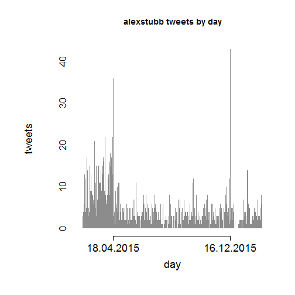

# Wellcome

<description of the project>

## Explorative analysis


mindate     | maxdate     | tweets
----------- | ----------- | -------
14.02.2015 | 19.02.2016 | 1740


### Monthly tweets


```r
par(mar=c(8,9,6,4))
h <- hist(main="",
     tw$created, breaks="month", freq=T, 
     xlab="",ylab="", las=2,
     labels=T, cex.axis=2.2, cex.lab=2.4,
     ylim= c(0,400), format="%Y-%m",
     col="cadetblue3")
mtext(side = 2, text = "tweets", line = 5, cex = 2.7)
```


### Daily tweets


```r
par(mar=c(7,9,5,3))
h <- hist(main="",tw$created, breaks="days", freq=T, 
          xlab="", ylab="",col="grey55", lty=0,
          cex.axis=2.5 ,cex.lab=2.5, tck=0.05, xaxt="n")
peaks=2
tickpos <- h$breaks[order(h$counts,decreasing=T)[1:peaks]]
labels <- names(sort(table(format(tw$created,"%d.%m.%Y")),decreasing=T))[1:peaks]
axis(1, at=tickpos, labels=labels,cex.axis=2.5)
mtext(side = 2, text = "tweets", line = 5, cex = 2.7)
mtext(side = 1, text = "day", line = 3, cex = 2.7)
```



### Hourly tweets


```r
hourly <- table(format(tw$created,"%H"))
hourly_prc <- paste(round(100*hourly/sum(hourly),1),"%")
par(mar=c(8,10,5,3))
bp <- barplot(hourly, space=0.5, ylim=c(0,250),
              ylab="",cex.lab=2.5, cex.names = 2.5,
              cex.axis=2.5, las=2, col = "deepskyblue3",
              xlab="")
text(bp+0.1, hourly, hourly_prc, pos=3, cex=1.3) 
mtext(side = 2, text = "tweets", line = 5, cex = 2.7)
mtext(side = 1, text = "time", line = 5, cex = 2.4)
```


### Most active tweet days


```r
top10tweetdays <- sort(table(format(tw$created,"%Y-%m-%d")),decreasing=T)[1:10]
top10tweetdays
```

```
## 
## 2015-12-16 2015-04-18 2015-04-01 2015-04-16 2015-03-10 2015-04-12 
##         43         36         22         22         21         18 
## 2015-02-22 2015-03-28 2015-04-14 2015-03-29 
##         17         17         17         16
```

```r
top10days <- names(top10tweetdays)

topdaydata <- lapply(1:4,function(day) {
  get_datedata(tw, top10days[day])
})


newpar <- par(mfrow=c(2,2))
for(i in 1:4){
  time <- topdaydata[[i]]$created
  hist(time, breaks=100,freq=T,border=NULL,ylab="Tweets",
       tck=0,cex.axis=0.8,cex.lab=0.6, xlab="",
       main=paste0(tweeter," ",i ,". most active tweet day"),
       cex.main=0.7, ylim=c(0,8))
}
```


